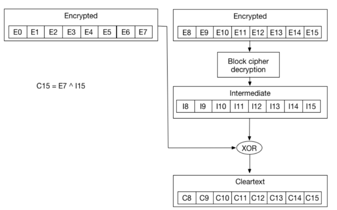

# Padding Oracle Attack Lab

This week's suggested lab was Padding Oracle Attack Lab, from SEED labs, with the intent of providing us with a better understanding of an interesting attack on crypto systems.

# Introduction

In this lab, an attack called *padding oracle attack* is explored. It was originally published in 2002 by Serge Vaudenay and affected many well-known systems, including Ruby on Rails, ASP.NET, and OpenSSL.

# Tasks

## Task 1

In the first task, the goal is to get familiar with padding in block ciphers that use PKCS#5. In this case, the Cipher Block Chaining mode (CBC).

First, we create three files containing 5 bytes, 10 bytes, and 16 bytes, respectively. We can do this with the following command:

```
┌──(kali㉿kali)-[~/…/seed-labs/category-crypto/Crypto_Padding_Oracle/Labsetup/task1]
└─$ echo -n "12345" > f1.txt     
                                   
┌──(kali㉿kali)-[~/…/seed-labs/category-crypto/Crypto_Padding_Oracle/Labsetup/task1]
└─$ echo -n "1234512345" > f2.txt
                                   
┌──(kali㉿kali)-[~/…/seed-labs/category-crypto/Crypto_Padding_Oracle/Labsetup/task1]
└─$ echo -n "1234512345123456" > f3.txt
```

Then, using the CBC mode we first encrypt the 5 bytes file and then check the encrypted file size, which is 16 bytes, meaning 11 bytes were added in the encryption process. Note that, as we used AES CBC with 128-bit keys, the block size is always 16 bytes. That's why the file sizes after padding is a multiple of 16.

```
┌──(kali㉿kali)-[~/…/category-crypto/Crypto_Padding_Oracle/Labsetup/task1]
└─$ openssl enc -aes-128-cbc -e -p -in f1.txt -out f1_enc.txt \
-K 00112233445566778889aabbccddeeff
-iv 0102030405060708
hex string is too short, padding with zero bytes to length
salt=4A923758317F0000
key=00112233445566778889AABBCCDDEEFF
iv =01020304050607080000000000000000
                                                                             
┌──(kali㉿kali)-[~/…/category-crypto/Crypto_Padding_Oracle/Labsetup/task1]
└─$ ll
total 16
-rw-r--r-- 1 kali kali 16 Apr  8 13:32 f1_enc.txt
-rw-r--r-- 1 kali kali  5 Apr  8 13:30 f1.txt
-rw-r--r-- 1 kali kali 10 Apr  8 13:30 f2.txt
-rw-r--r-- 1 kali kali 16 Apr  8 13:31 f3.txt
```

Then, by decrypting the file with the `-nopad` option, which makes the decryption not remove the padded data, we can observe that the decrypted file indeed has, again, 16 bytes.

```
┌──(kali㉿kali)-[~/…/category-crypto/Crypto_Padding_Oracle/Labsetup/task1]
└─$ openssl enc -aes-128-cbc -d -nopad -p -in f1_enc.txt -out f1_dec.txt \
-K 00112233445566778889aabbccddeeff
hex string is too short, padding with zero bytes to length
salt=4A52B536EE7F0000
key=00112233445566778889AABBCCDDEEFF
iv =01020304050607080000000000000000
                                                                                                         
┌──(kali㉿kali)-[~/…/category-crypto/Crypto_Padding_Oracle/Labsetup/task1]
└─$ ll    
total 20
-rw-r--r-- 1 kali kali 16 Apr  8 13:39 f1_dec.txt
-rw-r--r-- 1 kali kali 16 Apr  8 13:32 f1_enc.txt
-rw-r--r-- 1 kali kali  5 Apr  8 13:30 f1.txt
-rw-r--r-- 1 kali kali 10 Apr  8 13:30 f2.txt
-rw-r--r-- 1 kali kali 16 Apr  8 13:31 f3.txt
```

Finally, by inspecting the contents of the decrypted file we see that 11 `0x0b` (which is 11) bytes are padded. 

```
┌──(kali㉿kali)-[~/…/category-crypto/Crypto_Padding_Oracle/Labsetup/task1]
└─$ hexdump -C f1_dec.txt      
00000000  31 32 33 34 35 0b 0b 0b  0b 0b 0b 0b 0b 0b 0b 0b  |12345...........|
00000010
```

Therefore, we can conclude that the CBC mode uses paddings.

In the case of the 10 bytes file, there is also padding of 6 `0x06` (which is 6) bytes long. Basically, in PKCS#5, if the block size is B and the last block has K bytes, then `B - K` bytes of value `B - K` will be added as the padding. Finally, in the case of the 16 bytes file, which is already a multiple of the block size, we get a 32-byte ciphertext, i.e., a full block is added as padding. When we decrypt the ciphertext using the `-nopad` option, we can see that the added block contained 16 of `0x10`'s (which is 16). If we do not use the `-nopad` option, the decryption program knows that these 16 bytes are padding data. Therefore, in PKCS#5, if the input length is already an exact multiple of the block size B, then B bytes of value B will be added as padding. Note that with the CBC mode, we need to provide to the ciphering mode the Initialization Vector (IV) to ensure that even if two plaintexts are identical, their ciphertexts are still different, assuming different IVs will be used. As mentioned, CBC is a Block cipher method, meaning a block always has to be ciphered. And when the message to ciphered is smaller than the block size, padding is added to fill it up until it reaches the block size.

## Task 2

In this task, we are given a padding oracle that has a secret message inside and prints out the ciphertext of this secret message. The oracle will decrypt the ciphertext using its own secret key `K` and `IV` provided by us. It doesn't tell us the plaintext, but it tells whether the padding is valid or not. Our task is to use the information provided by the oracle to figure out the actual content of the secret message. To do this we use an approach called *Padding Oracle Attack* that allows us to get the plaintext of the last block. 

It's easier to explain with an image:



The previous image depicts an iteration in the decryption of a block of ciphertext in the CBC mode. We also see that `C15 = E7 ⊕ I15`. Then "encrypted" boxes are blocks of ciphertext. The "intermediate" is the output of the block cipher decryption using the last ciphertext block as input. Finally, the XOR operation between the previous ciphertext block and the last ciphertext block gives us the last block of plaintext.

For the first stage of our attack, let us assume that `C15` has the value `0x01`. If we modify `E7` and keep changing its value so that `E7 ⊕ I15 = 0x01`, we will keep getting invalid padding. However, as we're working byte by byte, we only need a maximum of 256 attempts to get the right value for `E7` so that the padding oracle gives us a valid output saying the padding is right. Let this value be `E'7`. And since we know we get valid padding, we know that `E'7 ⊕ I15 = 0x01`. So, `0x01 = I15 ⊕ E'7`. And this gives us: `I15 = 0x01 ⊕ E'7`. By now, we have discovered the first byte of the "intermediate" box, which is our `D2` in the Seed Labs example. We also know the first byte of the plain text (`C15`), which is given by `C15 = E7 ⊕ I15`. Now the process repeats itself for padding of `0x02`, `0x03`, and so on. For the `0x02` example, when brute-forcing `C14`, we first need to compute another `E7` (let's call it `E''7`) that gives us `C15 = 0x02`. According to the PKCS#5 specification, we need to do that since we want the padding to be `\x02\x02` now. So, replacing `C15` with `0x02`, we know that `E''7 = 0x02 ⊕ I15`. We then move to the brute-forcing of `E6` to find the value that gives us valid padding, `E'6`. We can re-use the formula `I14 = 0x02 ⊕ E'6` and `C14 = E6 ⊕ I14`. Using this method, we can keep going until all the ciphertext is decrypted.

As requested, doing this for the first 6 bytes manually is given by the following (for a 16-byte block):

- **Ciphertext**
  - `C1 = a9b2554b0944118061212098f2f238cd`
  - `C2 = 779ea0aae3d9d020f3677bfcb3cda9ce`
  - `CC1 = 00000000000000000000000000000000`
- **1st byte**
  - `E'16 = 0xcf`
  - `I16 = 0x01 ⊕ E'16 = 0xce` 
  - `P16 = C16 ⊕ I16 = 0x03` (Note that `C16` belongs to `C1` not `C2`)
  - `CC1 = 000000000000000000000000000000cf`
- **2nd byte**
  - `E'15 = 0x39`
  - `I15 = 0x02 ⊕ E'15 = 0x3b` 
  - `P15 = C15 ⊕ I15 = 0x03` (Note that `C16` belongs to `C1` not `C2`)
  - `CC1 = 000000000000000000000000000039cc`
- **3rd byte**
  - `E'14 = 0xf2`
  - `I14 = 0x03 ⊕ E'14 = 0xf1` 
  - `P14 = C14 ⊕ I14 = 0x03` (Note that `C16` belongs to `C1` not `C2`)
  - `CC1 = 00000000000000000000000000f238cd`
- **4th byte**
  - `E'13 = 0x18`
  - `I13 = 0x04 ⊕ E'13 = 0x1c` 
  - `P13 = C13 ⊕ I13 = 0xee` (Note that `C16` belongs to `C1` not `C2`)
  - `CC1 = 00000000000000000000000018f53fca`
- **5th byte**
  - `E'12 = 0x40`
  - `I12 = 0x05 ⊕ E'12 = 0x45` 
  - `P12 = C12 ⊕ I12 = 0xdd` (Note that `C16` belongs to `C1` not `C2`)
  - `CC1 = 00000000000000000000004019f43ecb`
- **6th byte**
  - `E'11 = 0xea`
  - `I11 = 0x06 ⊕ E'11 = 0xec` 
  - `P11 = C11 ⊕ I11 = 0xcc` (Note that `C16` belongs to `C1` not `C2`)
  - `CC1 = 00000000000000000000ea431af73dc8`

In each byte of the plaintext (`P11-P16`) we're starting to get the secret message: `0xccddee030303`. Note that the last 3 bytes represent padding.

To do this in an automated way, we can use the following python script:

```python
#!/usr/bin/python3
import socket
from binascii import hexlify, unhexlify

# XOR two bytearrays
def xor(first, second):
   return bytearray(x^y for x,y in zip(first, second))

class PaddingOracle:

    def __init__(self, host, port) -> None:
        self.s = socket.socket(socket.AF_INET, socket.SOCK_STREAM)
        self.s.connect((host, port))

        ciphertext = self.s.recv(4096).decode().strip()
        self.ctext = unhexlify(ciphertext)

    def decrypt(self, ctext: bytes) -> None:
        self._send(hexlify(ctext))
        return self._recv()

    def _recv(self):
        resp = self.s.recv(4096).decode().strip()
        return resp 

    def _send(self, hexstr: bytes):
        self.s.send(hexstr + b'\n')

    def __del__(self):
        self.s.close()

def decryptBlock(K, current_padding, CC1, D2, C2):
    if K > 16:
        return CC1, D2

    for i in range(256):
        CC1[16 - K] = i
        status = oracle.decrypt(IV + CC1 + C2)
        CC1_cp = CC1.copy()
        D2_cp = D2.copy()

        if status == "Valid":
            auxI = hex(i)[2:].zfill(2)
            D2[16 - K] = int(xor(bytearray.fromhex(current_padding), bytearray.fromhex(auxI)).hex(), base=16)
            current_padding = hex(int(current_padding, base=16) + 1)[2:].zfill(2)
            for x in range(1, K + 1):
                auxD2 = hex(D2[16 - x])[2:].zfill(2)
                CC1[16 - x] = int(xor(bytearray.fromhex(current_padding), bytearray.fromhex(auxD2)).hex(), base=16)

            print("Valid: i = 0x{:02x}".format(i))
            print("CC1: " + CC1.hex())

            CC1, D2 = decryptBlock(K + 1, current_padding, CC1, D2, C2)
            if CC1 != [] and D2 != []:
                return CC1, D2

        CC1 = CC1_cp
        D2 = D2_cp

    return [], []

if __name__ == "__main__":
    oracle = PaddingOracle('10.9.0.80', 5000)

    # Get the IV + Ciphertext from the oracle
    iv_and_ctext = bytearray(oracle.ctext)
    IV    = iv_and_ctext[00:16]
    C1    = iv_and_ctext[16:32]  # 1st block of ciphertext
    C2    = iv_and_ctext[32:48]  # 2nd block of ciphertext
    print("C1:  " + C1.hex())
    print("C2:  " + C2.hex())

    ###############################################################
    # Here, we initialize D2 with C1, so when they are XOR-ed,
    # The result is 0. This is not required for the attack.
    # Its sole purpose is to make the printout look neat.
    # In the experiment, we will iteratively replace these values.
    D2 = bytearray(16)

    D2[0]  = C1[0]
    D2[1]  = C1[1]
    D2[2]  = C1[2]
    D2[3]  = C1[3]
    D2[4]  = C1[4]
    D2[5]  = C1[5]
    D2[6]  = C1[6]
    D2[7]  = C1[7]
    D2[8]  = C1[8]
    D2[9]  = C1[9]
    D2[10] = C1[10]
    D2[11] = C1[11]
    D2[12] = C1[12]
    D2[13] = C1[13]
    D2[14] = C1[14]
    D2[15] = C1[15]

    ###############################################################
    # In the experiment, we need to iteratively modify CC1
    # We will send this CC1 to the oracle, and see its response.
    CC1 = bytearray(16)

    CC1[0]  = 0x00
    CC1[1]  = 0x00
    CC1[2]  = 0x00
    CC1[3]  = 0x00
    CC1[4]  = 0x00
    CC1[5]  = 0x00
    CC1[6]  = 0x00
    CC1[7]  = 0x00
    CC1[8]  = 0x00
    CC1[9]  = 0x00
    CC1[10] = 0x00
    CC1[11] = 0x00
    CC1[12] = 0x00
    CC1[13] = 0x00
    CC1[14] = 0x00
    CC1[15] = 0x00

    ###############################################################
    # In each iteration, we focus on one byte of CC1.  
    # We will try all 256 possible values, and send the constructed
    # ciphertext CC1 + C2 (plus the IV) to the oracle, and see 
    # which value makes the padding valid. 
    # As long as our construction is correct, there will be 
    # one valid value. This value helps us get one byte of D2. 
    # Repeating the method for 16 times, we get all the 16 bytes of D2.

    current_padding = "01"
    CC1, D2 = decryptBlock(1, current_padding, CC1, D2, C2)

    ###############################################################

    # Once you get all the 16 bytes of D2, you can easily get P2
    P2 = xor(C1, D2)
    print("P2:  " + P2.hex())
```

When executing it, it shows us the various iterations of the attack:

```
──(kali㉿kali)-[~/…/seed-labs/category-crypto/Crypto_Padding_Oracle/Labsetup]
└─$ python3 manual_attack.py
C1:  a9b2554b0944118061212098f2f238cd
C2:  779ea0aae3d9d020f3677bfcb3cda9ce
Valid: i = 0xcf
CC1: 000000000000000000000000000000cc
Valid: i = 0x39
CC1: 000000000000000000000000000038cd
Valid: i = 0xf2
CC1: 00000000000000000000000000f53fca
Valid: i = 0x18
CC1: 00000000000000000000000019f43ecb
Valid: i = 0x40
CC1: 0000000000000000000000431af73dc8
Valid: i = 0xea
CC1: 00000000000000000000eb421bf63cc9
Valid: i = 0x9d
CC1: 00000000000000000092e44d14f933c6
Valid: i = 0xc3
CC1: 0000000000000000c293e54c15f832c7
Valid: i = 0x01
CC1: 0000000000000002c190e64f16fb31c4
Valid: i = 0x6c
CC1: 0000000000006d03c091e74e17fa30c5
Valid: i = 0x29
CC1: 00000000002e6a04c796e04910fd37c2
Valid: i = 0x50
CC1: 00000000512f6b05c697e14811fc36c3
Valid: i = 0x02
CC1: 00000001522c6806c594e24b12ff35c0
Valid: i = 0x68
CC1: 00006900532d6907c495e34a13fe34c1
Valid: i = 0x9f
CC1: 0080761f4c327618db8afc550ce12bde
Valid: i = 0xa8
CC1: a981771e4d337719da8bfd540de02adf
P2:  1122334455667788aabbccddee030303
```

We finally get the last block of plaintext in the last line (`P2:  1122334455667788aabbccddee030303
`).

This script follows the same logic as explained above. There's a special case we still have to pay attention to. There are cases where more than one padding is accepted by the oracle, for example:

- A block like `0xAAAAAAAAAAAAAAAAAA07070707070707` where the last byte is `0x07`.
- A block like `0xAAAAAAAAAAAAAAAAAA07070707070701` where the last byte is `0x01`. 

To overcome this, we created the `decryptBlock` function which decrypts each block recursively by iterating a maximum of 256 times per byte. If it happens to find the right byte for the operation, it moves on to the next byte. But if a special case like the one mentioned happens, it can backtrack to pick the right byte for each iteration.

## Task 3

In the last task, we are asked to decrypt the block in an automated way. It's a bit like what we did in the previous task. But instead, this time we connect to port 6000 of the oracle, which outputs a total of 64 bytes. Meaning 16 bytes for the IV and 3 blocks of 16 bytes each of ciphertext. Also, this time we want to decrypt not just the last block, but all the blocks.

The following python script was used:

```python
#!/usr/bin/python3
import socket
from binascii import hexlify, unhexlify

from numpy import block
from tables import Complex128Col

# XOR two bytearrays
def xor(first, second):
   return bytearray(x^y for x,y in zip(first, second))

class PaddingOracle:

    def __init__(self, host, port) -> None:
        self.s = socket.socket(socket.AF_INET, socket.SOCK_STREAM)
        self.s.connect((host, port))

        ciphertext = self.s.recv(4096).decode().strip()
        self.ctext = unhexlify(ciphertext)

    def decrypt(self, ctext: bytes) -> None:
        self._send(hexlify(ctext))
        return self._recv()

    def _recv(self):
        resp = self.s.recv(4096).decode().strip()
        return resp 

    def _send(self, hexstr: bytes):
        self.s.send(hexstr + b'\n')

    def __del__(self):
        self.s.close()

def decryptBlock(K, current_padding, CC1, D2, C2):
    if K > 16:
        return CC1, D2

    for i in range(256):
        CC1[16 - K] = i
        status = oracle.decrypt(IV + CC1 + C2)
        CC1_cp = CC1.copy()
        D2_cp = D2.copy()

        if status == "Valid":
            auxI = hex(i)[2:].zfill(2)
            D2[16 - K] = int(xor(bytearray.fromhex(current_padding), bytearray.fromhex(auxI)).hex(), base=16)
            current_padding = hex(int(current_padding, base=16) + 1)[2:].zfill(2)
            for x in range(1, K + 1):
                auxD2 = hex(D2[16 - x])[2:].zfill(2)
                CC1[16 - x] = int(xor(bytearray.fromhex(current_padding), bytearray.fromhex(auxD2)).hex(), base=16)

            print("Valid: i = 0x{:02x}".format(i))
            print("CC1: " + CC1.hex())

            CC1, D2 = decryptBlock(K + 1, current_padding, CC1, D2, C2)
            if CC1 != [] and D2 != []:
                return CC1, D2

        CC1 = CC1_cp
        D2 = D2_cp

    return [], []

if __name__ == "__main__":
    oracle = PaddingOracle('10.9.0.80', 6000)
    BLOCK_SIZE = 16

    # Get the IV + Ciphertext from the oracle
    iv_and_ctext = bytearray(oracle.ctext)
    num_blocks = int((len(iv_and_ctext) - BLOCK_SIZE) / BLOCK_SIZE)
    block_1_ciphertxt_idx = (num_blocks - 1) * BLOCK_SIZE
    block_2_ciphertxt_idx = num_blocks * BLOCK_SIZE
    IV    = iv_and_ctext[00:BLOCK_SIZE]

    decipheredText = ""
    current_block = num_blocks
    for i in range(num_blocks - 1):
        C1    = iv_and_ctext[block_1_ciphertxt_idx:(block_1_ciphertxt_idx + BLOCK_SIZE)]  # 1st block of ciphertext
        C2    = iv_and_ctext[block_2_ciphertxt_idx:(block_2_ciphertxt_idx + BLOCK_SIZE)]  # 2nd block of ciphertext
        print("C1:  " + C1.hex())
        print("C2:  " + C2.hex())

        D2 = bytearray(16)

        D2[0]  = C1[0]
        D2[1]  = C1[1]
        D2[2]  = C1[2]
        D2[3]  = C1[3]
        D2[4]  = C1[4]
        D2[5]  = C1[5]
        D2[6]  = C1[6]
        D2[7]  = C1[7]
        D2[8]  = C1[8]
        D2[9]  = C1[9]
        D2[10] = C1[10]
        D2[11] = C1[11]
        D2[12] = C1[12]
        D2[13] = C1[13]
        D2[14] = C1[14]
        D2[15] = C1[15]

        CC1 = bytearray(16)

        CC1[0]  = 0x00
        CC1[1]  = 0x00
        CC1[2]  = 0x00
        CC1[3]  = 0x00
        CC1[4]  = 0x00
        CC1[5]  = 0x00
        CC1[6]  = 0x00
        CC1[7]  = 0x00
        CC1[8]  = 0x00
        CC1[9]  = 0x00
        CC1[10] = 0x00
        CC1[11] = 0x00
        CC1[12] = 0x00
        CC1[13] = 0x00
        CC1[14] = 0x00
        CC1[15] = 0x00

        current_padding = "01"
        CC1, D2 = decryptBlock(1, current_padding, CC1, D2, C2)

        P = xor(C1, D2)
        print("\n\n###############################################################")
        print("Current Block: %d" % current_block)
        print("P:  " + P.hex())
        decipheredText = P.hex() + decipheredText
        print("###############################################################\n\n")

        block_1_ciphertxt_idx -= BLOCK_SIZE
        block_2_ciphertxt_idx -= BLOCK_SIZE
        current_block -= 1
    
    # First block (Special Case)
    current_padding = "01"
    CC1, D2 = decryptBlock(1, current_padding, CC1, D2, iv_and_ctext[16:32])
    P = xor(D2, IV)
    print("\n\n###############################################################")
    print("Current Block: %d" % current_block)
    print("P:  " + P.hex())
    decipheredText = P.hex() + decipheredText
    print("###############################################################\n\n")

    print("Plaintext (HEX): " + decipheredText)
    print("Plaintext (ASCII): " + bytes.fromhex(decipheredText).decode("unicode_escape"))
```

Using the same approach as in the previous task, we use the `decryptBlock` function to decrypt each block and use a next-to-last byte approach, meaning for each iteration of the decyphering process, the last block will be a block of the ciphertext. The exception is the first block. Here, as we know the `IV`, we just need to discover the output of the block cipher and XOR it with the `IV` to get the plaintext's first block. By running the script, we get the following output:

```
┌──(kali㉿kali)-[~/…/seed-labs/category-crypto/Crypto_Padding_Oracle/Labsetup]
└─$ python3 allblocks_attack.py
C1:  d6fd1ea0b3a77814c65a28bac175a57a
C2:  f01ebd43c751d4ec0d4a95e3d46f7b13
Valid: i = 0x79
CC1: 0000000000000000000000000000007a
Valid: i = 0xa5
CC1: 0000000000000000000000000000a47b
Valid: i = 0x5f
CC1: 0000000000000000000000000058a37c
Valid: i = 0x9b
CC1: 0000000000000000000000009a59a27d
Valid: i = 0xe0
CC1: 0000000000000000000000e3995aa17e
Valid: i = 0x70
CC1: 0000000000000000000071e2985ba07f
Valid: i = 0x75
CC1: 0000000000000000007a7eed9754af70
Valid: i = 0xe7
CC1: 0000000000000000e67b7fec9655ae71
Valid: i = 0x43
CC1: 0000000000000040e5787cef9556ad72
Valid: i = 0x2d
CC1: 0000000000002c41e4797dee9457ac73
Valid: i = 0xf2
CC1: 0000000000f52b46e37e7ae99350ab74
Valid: i = 0x97
CC1: 0000000096f42a47e27f7be89251aa75
Valid: i = 0x8d
CC1: 0000008e95f72944e17c78eb9152a976
Valid: i = 0x31
CC1: 0000308f94f62845e07d79ea9053a877
Valid: i = 0x86
CC1: 00992f908be9375aff6266f58f4cb768
Valid: i = 0xa7
CC1: a6982e918ae8365bfe6367f48e4db669


###############################################################
Current Block: 3
P:  61742120285e5f5e29285e5f5e290202
###############################################################


C1:  fb4ae090144112e5a455805639701e9a
C2:  d6fd1ea0b3a77814c65a28bac175a57a
Valid: i = 0xfe
CC1: 000000000000000000000000000000fd
Valid: i = 0x6e
CC1: 00000000000000000000000000006ffc
Valid: i = 0x14
CC1: 000000000000000000000000001368fb
Valid: i = 0x1d
CC1: 0000000000000000000000001c1269fa
Valid: i = 0x36
CC1: 0000000000000000000000351f116af9
Valid: i = 0xf4
CC1: 00000000000000000000f5341e106bf8
Valid: i = 0x33
CC1: 0000000000000000003cfa3b111f64f7
Valid: i = 0x8c
CC1: 00000000000000008d3dfb3a101e65f6
Valid: i = 0x9f
CC1: 000000000000009c8e3ef839131d66f5
Valid: i = 0x7a
CC1: 0000000000007b9d8f3ff938121c67f4
Valid: i = 0x2b
CC1: 00000000002c7c9a8838fe3f151b60f3
Valid: i = 0x54
CC1: 00000000552d7d9b8939ff3e141a61f2
Valid: i = 0xbd
CC1: 000000be562e7e988a3afc3d171962f1
Valid: i = 0xaa
CC1: 0000abbf572f7f998b3bfd3c161863f0
Valid: i = 0x00
CC1: 001fb4a0483060869424e22309077cef
Valid: i = 0xae
CC1: af1eb5a1493161879525e32208067dee


###############################################################
Current Block: 2
P:  454544204c6162732061726520677265
###############################################################


Valid: i = 0xb4
CC1: af1eb5a1493161879525e32208067db7
Valid: i = 0xbe
CC1: af1eb5a1493161879525e3220806bfb6
Valid: i = 0xb1
CC1: af1eb5a1493161879525e32208b6b8b1
Valid: i = 0xa6
CC1: af1eb5a1493161879525e322a7b7b9b0
Valid: i = 0x08
CC1: af1eb5a1493161879525e30ba4b4bab3
Valid: i = 0x4f
CC1: af1eb5a14931618795254e0aa5b5bbb2
Valid: i = 0x26
CC1: af1eb5a14931618795294105aabab4bd
Valid: i = 0x52
CC1: af1eb5a14931618753284004abbbb5bc
Valid: i = 0x7c
CC1: af1eb5a14931617f502b4307a8b8b6bf
Valid: i = 0xda
CC1: af1eb5a14931db7e512a4206a9b9b7be
Valid: i = 0x97
CC1: af1eb5a14990dc79562d4501aebeb0b9
Valid: i = 0xef
CC1: af1eb5a1ee91dd78572c4400afbfb1b8
Valid: i = 0x86
CC1: af1eb585ed92de7b542f4703acbcb2bb
Valid: i = 0x68
CC1: af1e6984ec93df7a552e4602adbdb3ba
Valid: i = 0x22
CC1: af3d769bf38cc0654a31591db2a2aca5
Valid: i = 0xc1
CC1: c03c779af28dc1644b30581cb3a3ada4


###############################################################
Current Block: 1
P:  285e5f5e29285e5f5e29205468652053
###############################################################


Plaintext (HEX): 285e5f5e29285e5f5e29205468652053454544204c616273206172652067726561742120285e5f5e29285e5f5e290202
Plaintext (ASCII): (^_^)(^_^) The SEED Labs are great! (^_^)(^_^)
```

As seen, the final message is `(^_^)(^_^) The SEED Labs are great! (^_^)(^_^)`.