# Public-Key Infrastructure (PKI) Lab

This week's suggested lab was [Public-Key Infrastructure (PKI)](https://seedsecuritylabs.org/Labs_20.04/Crypto/Crypto_PKI/), from SEED labs. Public key cryptography is the foundation of today's secure communication, but it is subject to man-in-the-middle attacks when one side of communication sends its public key to the other side.

## Task 1

In this first task, we have to create a CA (Certificate Authority) to issue digital certificates. We start by copying the OpenSSL configuration file to our working directory:

```bash=
cp /usr/lib/ssl/openssl.cnf .
```

Then we edit the file. We start by uncommenting the `unique subject` line to allow the creation
of certifications with the same subject.

<figure align="center">
  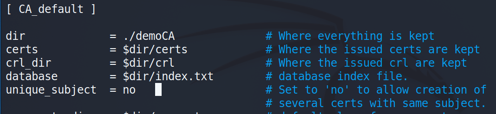
  <figcaption>Figure 1. OpenSSL configuration file update</figcaption>
</figure>

The next step was to create an empty `index.txt` file and a serial file in the current directory. The serial file contains a single number in string format.

```bash=
touch index.txt
echo 1000 > serial
```

For generating a self-signed certificate for the CA, we ran the following command:

<figure align="center">
  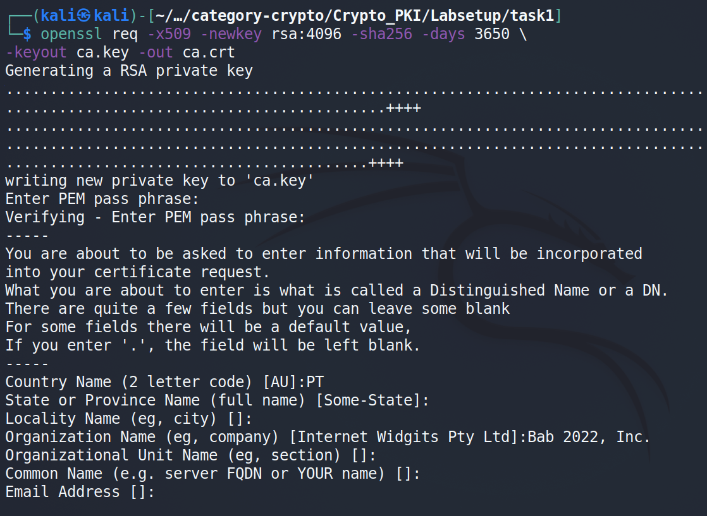
  <figcaption>Figure 2. Generating a self-signed certificate for the CA</figcaption>
</figure>

Note that we are prompted to enter some information, namely a password, the country name, and the organization name. The command's output is stored in two files: `ca.key` and `ca.crt`. The file `ca.key` contains the CA’s private key, while `ca.crt` contains the public-key certificate.

We can use the following commands to look at the decoded content of the X509 certificate and the RSA key:

```bash=
openssl x509 -in ca.crt -text -noout
openssl rsa -in ca.key -text -noout
```

From the output of these commands, we can make some conclusions, namely:

-   The generated certificate is a CA certificate, as we can see by the following screenshot:
    <figure align="center">
        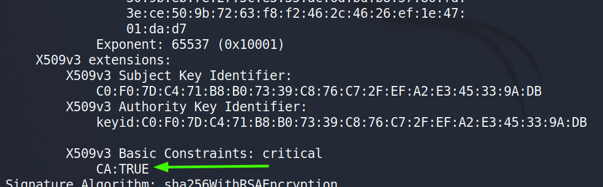
        <figcaption>Figure 3. CA certificate</figcaption>
    </figure>
-   The certificate is self-signed, because the Subject Key Identifier is the same as the Authority Key Identifier.
    <figure align="center">
        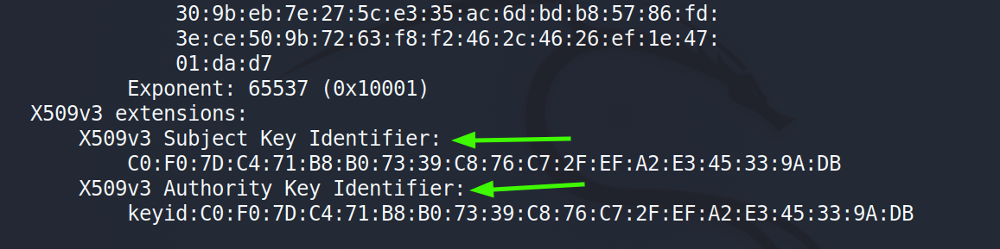
        <figcaption>Figure 4. Self-signed certificate</figcaption>
    </figure>
-   For the certificate file, the modulus `n` is identified by the following screenshot:
    <figure align="center">
        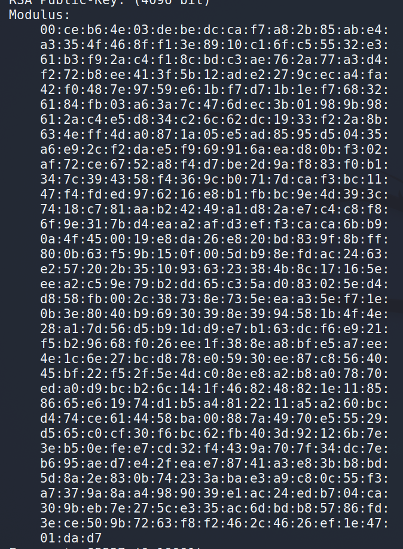
        <figcaption>Figure 5. Modulus in the certificate file</figcaption>
    </figure>
-   For the key file, the modulus `n` is identified by the following screenshot:
    <figure align="center">
        
        <figcaption>Figure 6. Modulus in the key file</figcaption>
    </figure>
-   For the certificate file, the public exponent `e` is identified by the following screenshot:
    <figure align="center">
        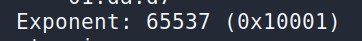
        <figcaption>Figure 7. Public exponent in the certificate file</figcaption>
    </figure>
-   For the key file, the public exponent `e` is identified by the following screenshot:
    <figure align="center">
        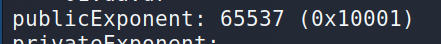
        <figcaption>Figure 8. Public exponent in the key file</figcaption>
    </figure>
-   For the key file, the private exponent `d` is identified by the following screenshot:
    <figure align="center">
        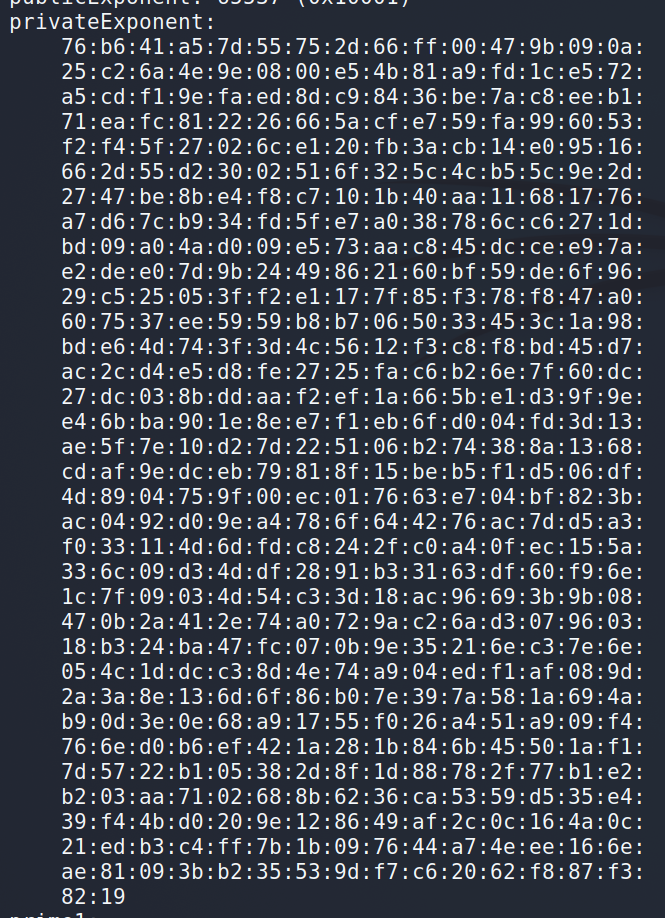
        <figcaption>Figure 9. Private exponent in the key file</figcaption>
    </figure>
-   For the key file, the secret number `p` is identified by the following screenshot:
    <figure align="center">
        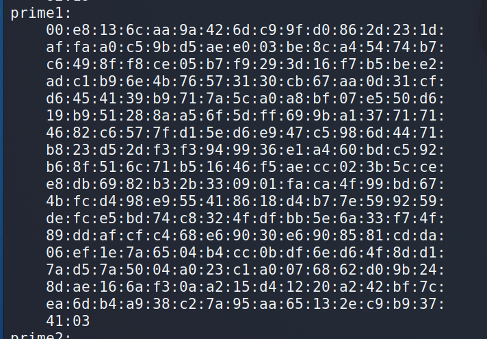
        <figcaption>Figure 10. Secret number p in the key file</figcaption>
    </figure>
-   For the key file, the secret number `q` is identified by the following screenshot:
    <figure align="center">
        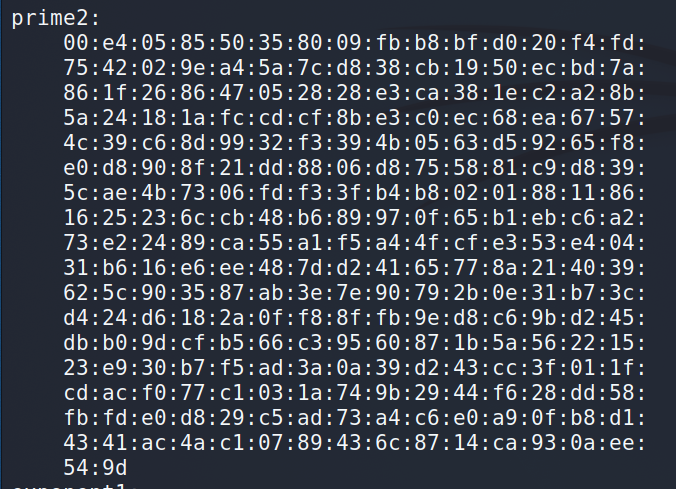
        <figcaption>Figure 11. Secret number q in the key file</figcaption>
    </figure>
-   The value of the modulus `n` is equal to `p` \* `q`.

## Task 2

This task aims to generate a Certificate Request for our Web Server. The following command generates a CSR for `www.bab2022.com` (our Web Server):

<figure align="center">
    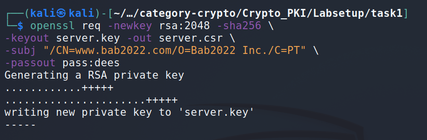
    <figcaption>Figure 12. Generating a CSR for www.bab2022.com</figcaption>
</figure>

We can use the following command to look at the decoded content of the CSR and private key files:

```bash=
openssl req -in server.csr -text -noout
openssl rsa -in server.key -text -noout
```

Next, we add two alternative names to our certificate signing request so that the Subject Alternative Name (SAN) extension is attached to the certificate. With the SAN extension, it is possible to specify several hostnames in the `subjectAltName` field of the certificate.

<figure align="center">
    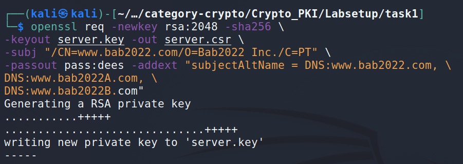
    <figcaption>Figure 13. Adding two alternative names to our certificate signing request</figcaption>
</figure>

## Task 3

In this task, we must generate a certificate for the server. We do this by sending the Certificate Signing Request (CSR) file to the CA for their signature. Using the following command, we can accomplish that:

<figure align="center">
    
    <figcaption>Figure 14. Sending the CSR file to the CA for their signature</figcaption>
</figure>

The `openssl.cnf` is the configuration file from Task 1. To enable the extension Subject Alternative Name (SAN) mentioned in Task 2, so that the website can have different URLs, we must uncomment the `copy_extensions = copy` in the `openssl.cnf` file. Finally, to print out the decoded content of the certificate and check whether the alternative names are included, we use the command `openssl x509 -in server.crt -text -noout`. In the following image, under the `X509 Subject Alternative Name`, we can see the alternative URLs added:

<figure align="center">
    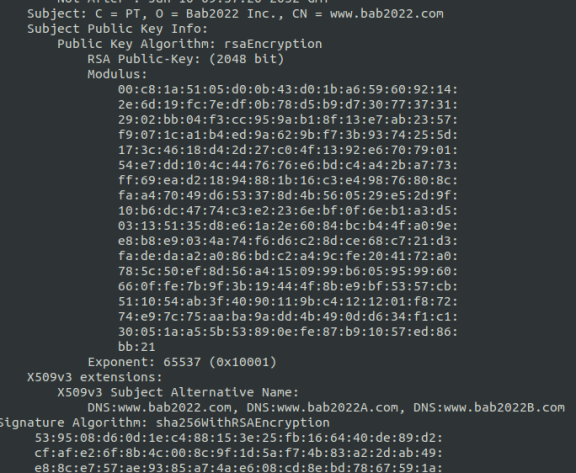
    <figcaption>Figure 15. Decoded content of the certificate with SAN extension included</figcaption>
</figure>

## Task 4

Having created a CA and learned how to generate requests and obtain digital certificates, we set up our HTTP site with an Apache server. For this, we use the already set up container in the lab setup and modify it to use our certificates.

First, we move our CA certificate and our "bab2022" server certificate to the `certs` folder.

<figure align="center">
    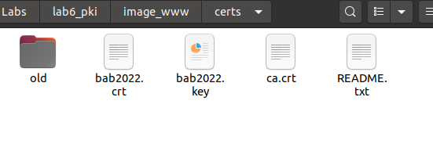
    <figcaption>Figure 16. CA certificate and our server certificate in the certs folder</figcaption>
</figure>

Then, we change the server's configuration file to set our server name and alias and the names of the new certificate and key files. The resulting file is as follows:

<figure align="center">
    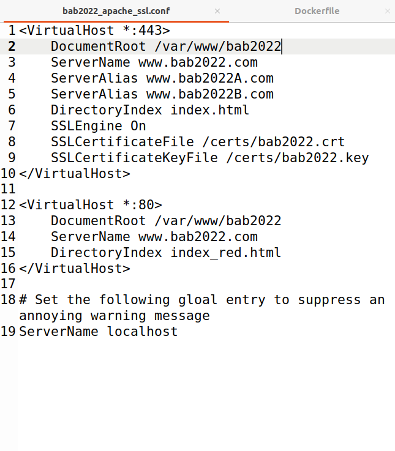
    <figcaption>Figure 17. Server's configuration file</figcaption>
</figure>

We also have to modify the Dockerfile to copy the correct files and set the correct suite name on the Apache server:

<figure align="center">
    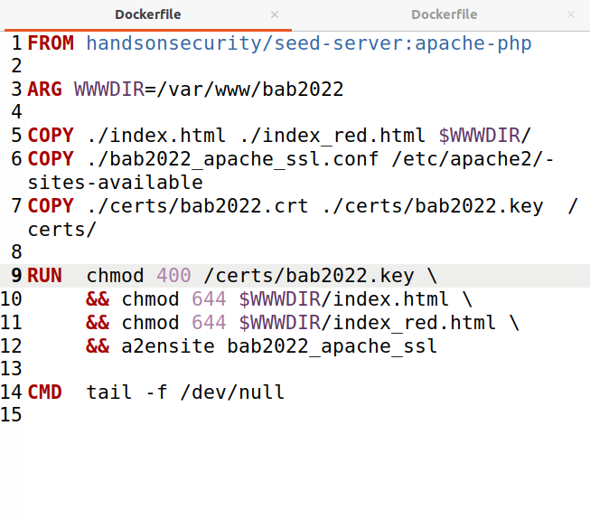
    <figcaption>Figure 18. Lab's Dockerfile</figcaption>
</figure>

After setting all the files correctly, we can run the containers using `docker-compose up --build` and start the Apache service in the container's shell.

<figure align="center">
    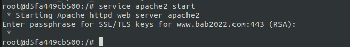
    <figcaption>Figure 19. Starting the Apache service</figcaption>
</figure>

Finally, we can browse the site by accessing `http://www.bab2022.com` and `https://www.bab2022.com`.

<figure align="center">
    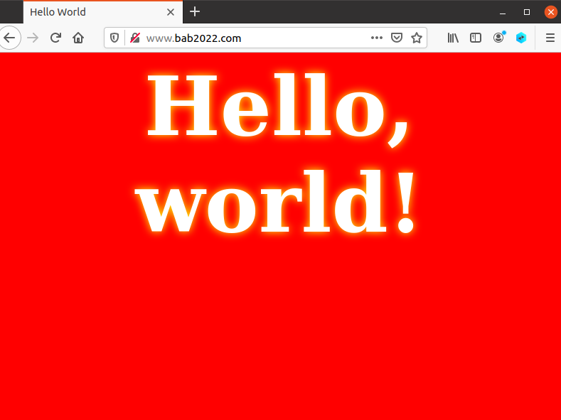
    <figcaption>Figure 20. http://www.bab2022.com</figcaption>
</figure>

<figure align="center">
    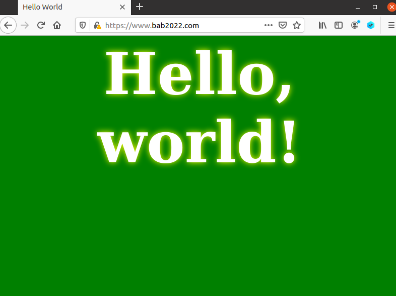
    <figcaption>Figure 21. https://www.bab2022.com</figcaption>
</figure>

We can see that when accessing the website without SSL (only HTTP), the resulting page is red, and when using HTTPS, the page is green. This is correct since it is set in the server configuration file. However, while in the HTTP site, the browser warns us that we still are not securely connected to the site:

<figure align="center">
    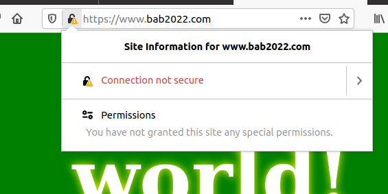
    <figcaption>Figure 22. https://www.bab2022.com (without importing the CA certificate to the browser)</figcaption>
</figure>

To fix this, we went to Firefox's configurations and, in the Authorities sections, imported our CA certificate to correctly identify our website.

<figure align="center">
    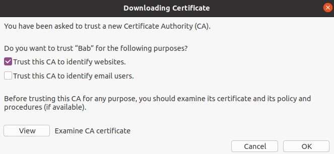
    <figcaption>Figure 23. Importing the CA</figcaption>
</figure>

<figure align="center">
    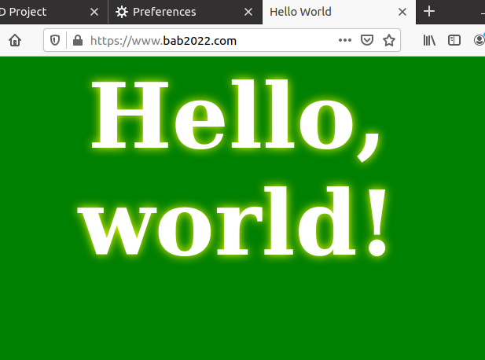
    <figcaption>Figure 24. https://www.bab2022.com (with valid certificate)</figcaption>
</figure>

Now, the connection to the website is entirely secure.

## Task 5

This task aims to explore how Man-In-The-Middle attacks (MITM) are made. MITM attacks could happen when, for example, a user accesses a website and asks the server for its public key so it can send him a secret key (Symmetric Encryption) encrypted with the server's public key, ensuring that only the server can see that secret. Here, what can go wrong is the part where the user asks for the server's public key. An attacker can intercept the communication between the user and the server and pass his public key instead of the server's public key. Essentially the attacker works as a proxy, therefore seeing the entire communication. PKI defeats MITM attacks because when the server sends the public key to the user, the attacker cannot change it, as was digitally signed by the server. Once a message is signed, nobody can alter the content of the message without rendering the signature invalid.

In this task, we will impersonate `www.example.com` using our server. The goal here is that when a user visits `www.example.com`, we will redirect him to our `www.example.com`, which lives under a different IP than the original. If this page contained a form, we could call this a "setup for a phishing attack". The first step is to add a new `VirtualHost` entry to the `etc/apache2/sites-available/bank32_apache_ssl.conf`:

```
<VirtualHost *:443>
    DocumentRoot /var/www/bank32
    ServerName www.example.com
    DirectoryIndex index.html
    SSLEngine On
    SSLCertificateFile /certs/server.crt
    SSLCertificateKeyFile /certs/server.key
</VirtualHost>
```

Next, we restart the apache2 server by doing `service apache2 restart`.

Then, we simulate an attack to the DNS of the victim, changing the `/etc/hosts` file by adding the following line:

```
10.9.0.80    www.example.com
```

By the end of this task, if we access `www.example.com`, as we are using the same certificate as in `www.bab2022.com`, the browser warns us that this certificate is not for `example.com` by comparing the visited URL with the `Common Name` presented in the certificate. We can see that warning in the following image:

<figure align="center">
    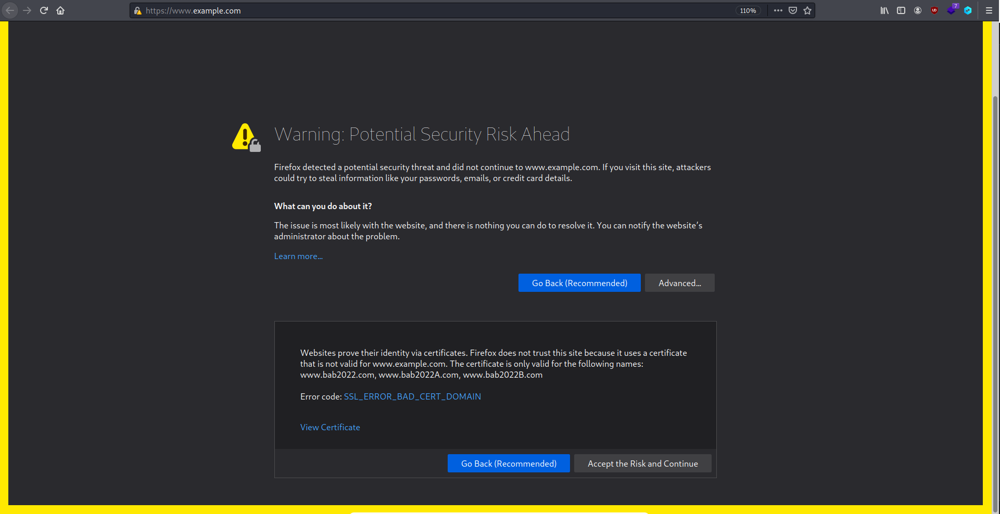
    <figcaption>Figure 25. Warning: Potential Security Risk Ahead</figcaption>
</figure>

In the next section, we will see how we can fix that!

# Task 6

Having deployed our fake `www.example.com` website and having the private key of the root CA created in the first task means we can make the root CA sign every certificate we want. In this case, we want the root CA to sign the certificate for `www.example.com` so that the browser does not warn the user that is visiting our page that the certificate is invalid, either because it does not belong to the searched URL or because the CA that signed the certificate does not show up in the browser. So, we will create a certificate for `www.example.com` signed by the compromised root CA.

First, we generate a certificate request for `www.example.com` by doing:

```
openssl req -newkey rsa:2048 -sha256  \
    -keyout fake.key   -out fake.csr  \
    -subj "/CN=www.example.com/O=example Inc./C=US" \
    -passout pass:dees
```

Next, we generate a certificate for the server, using the root CA, by doing:

```
openssl ca -config openssl.cnf -policy policy_anything \
-md sha256 -days 3650 \
-in fake.csr -out fake.crt -batch \
-cert ca.crt -keyfile ca.key
```

Then, after generating our `fake.crt` and `fake.key` for `www.example.com`, we need to put it inside the container in the `certs/` folder.

Then we change the `VirtualHost` entry for `www.example.com` in `/etc/apache2/sites-available/bank32_apache_ssl.conf` to:

```
<VirtualHost *:443>
    DocumentRoot /var/www/bank32
    ServerName www.example.com
    DirectoryIndex index.html
    SSLEngine On
    SSLCertificateFile /certs/fake.crt
    SSLCertificateKeyFile /certs/fake.key
</VirtualHost>
```

Lastly, we restart the apache2 server (`service apache2 restart`) to load our new configuration, and we are good to go!

The result presented when the user accesses our website will be the following:

<figure align="center">
    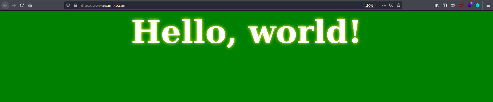
    <figcaption>Figure 26. https://www.example.com (with valid certificate)</figcaption>
</figure>

As we can see, there is no warning from the browser for the aforementioned reasons. The certificate for our new website can be seen in the following image:

<figure align="center">
    
    <figcaption>Figure 27. https://www.example.com (certificate)</figcaption>
</figure>
