# DNS Rebinding Attack

The objective of this lab is two-fold: (1) demonstrate how the DNS rebinding attack works, and (2) to gain first-hand experience on how to use the DNS rebinding technique to attack IoT devices.

## Introduction

First of all, it's important to understand how the DNS Rebinding Attack works. Assume that there is a server that is not accessible from outside. This server could be inside a private network, where the IP addresses are not public; it could also be a network that is protected by a firewall, as in the case of this lab. The server has a vulnerability; to exploit the vulnerability, attackers must be able to interact with the server, but they are not able to do it from outside; they have to get inside the network. A typical way to get the attacker's exploit program inside the network is through web browsing. If attackers get a user from inside the network to visit one of their web pages, the JavaScript code in their web pages will get a chance to run on the user's browser, which is running from inside the protected network. The code can then try to interact with the protected server using AJax, but will not be able to get the response from the server due to the inherent sandbox protection implemented by browsers. This is called **Same Origin Policy (SOP)**, which only allows Ajax code inside a web page to interact with the same server where the page comes from. It cannot interact with other servers. More accurately speaking, SOP does not prevent Ajax code from sending out requests, but it prevents the code from getting the reply data. This prevents the Ajax code from interacting with other servers, which can be dangerous. Nonetheless, the SOP is enforced based on the server's name, not on the server's IP address. So, if the victim's browser is configured to use a malicious DNS that at first maps the request for the website to the malicious web page but then maps subsequent requests to internal IPs, the SOP protection will be defeated and the Ajax code will be able to communicate with any server it wants.

The following topics will be covered in this lab:

- DNS server setup
- DNS rebinding attack
- Attacks on IoT devices
- Same Origin Policy

# Tasks

## Task 0 - Environment Setup

### Docker 

After running the `docker-compose.yml` file we get five containers and two bridges:

```bash
$ dockps

073b52abbb39  attacker-www-10.9.0.180
33801e5f3f68  iot-192.168.60.80
4cfda3d7ac85  router
cde782008b43  local-dns-server-10.9.0.53
f0337a6ab914  attacker-ns-10.9.0.153

$ docker network ls
...
fa9aae976019   net-10.9.0.0       bridge    local
c0aad7e79361   net-192.168.60.0   bridge    local
...
```

<figure align="center">
  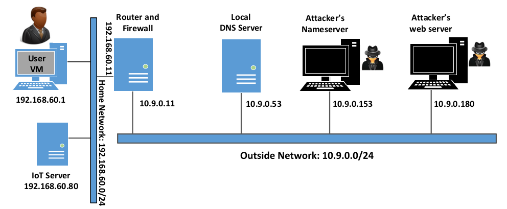
  <figcaption style="text-align: center;">Figure 1. Network Configuration</figcaption>
</figure>

As we can see, in the setup, we have two networks, a home network, and an outside network. The home network simulates a typical network at home. The User machine and the IoT services are connected to this network, which is protected by the firewall on the router container. The firewall blocks all traffic going to the `192.168.60.80`. This way, outside machines cannot access the IoT device. There's also a NAT server on the router, so the machines on the home network can access outside and the reply packets can come back. The second network simulates the outside world. In addition to the router, there are three containers attached to this network, one serving as the local DNS server, and the other two serving as the attacker’s name server and web server. The attacker owns the `attacker32.com` domain, which is hosted by the attacker's name server container. The web server hosts a malicious website used for the attack.

### Browser DNS Cache

To reduce the load on DNS servers and to speed up response time, the browser caches DNS results. By default, the cache's expiration time is 60 seconds. That means that our DNS rebinding attack needs to wait for at least 60 seconds. To make our life easier, we need to reduce this time. We changed this time to 10 seconds in the browser settings.

<figure align="center">
  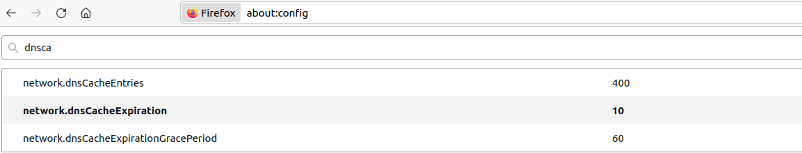
  <figcaption style="text-align: center;">Figure 2. Reducing DNS caching time in Firefox</figcaption>
</figure>

### IoT Server

The IoT device has a simple built-in web server (like many IoT devices), so users can interact with these devices. For the user to access this server, we had to add an entry to the `/etc/hosts` file. We used `www.seedIoT32.com` as the name for the IoT server. Its IP address is `192.168.60.80`. 

```bash
$ cat /etc/hosts
...
# For DNS Rebinding Lab
192.168.60.80   www.seedIoT32.com
...
```

Now, if we point the browser to `www.seedIoT32.com`, we can access the IoT server. As seen in the screenshot, we are able to see a thermostat. and to change the temperature setting by dragging the sliding bar. 

<figure align="center">
  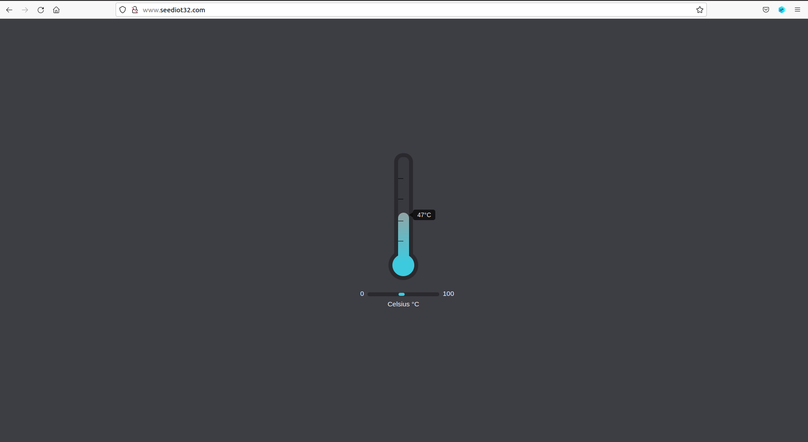
  <figcaption style="text-align: center;">Figure 3. Accessing www.seedIoT32.com</figcaption>
</figure>


### Local DNS Server

We also needed to get the User VM to use a particular local DNS server. This is achieved by setting the local DNS server as the first name server entry in the resolver configuration file
(`/etc/resolv.conf`). The problem is that the provided VM uses the Dynamic Host Configuration
Protocol (DHCP). This means that the `/etc/resolv.conf` file will be overwritten with the information provided by the DHCP server.
To get the information to the file, we added the following entry to the `/etc/resolvconf/resolv.conf.d/head` file:

```bash
nameserver 10.9.0.53
```

The content of the head file will be prepended to the dynamically generated resolver configuration file (normally it is just a comment).
After making the change, we ran the following command for the change to take effect:

```bash
$ sudo resolvconf -u
```

### Testing 

After configuring the User VM, we used the `dig` command to verify the IP address of `www.attacker32.com` and `ns.attacker32.com`.

```
$ dig www.attacker32.com

; <<>> DiG 9.16.1-Ubuntu <<>> www.attacker32.com
;; global options: +cmd
;; Got answer:
;; ->>HEADER<<- opcode: QUERY, status: NOERROR, id: 26849
;; flags: qr rd ra; QUERY: 1, ANSWER: 1, AUTHORITY: 0, ADDITIONAL: 1

;; OPT PSEUDOSECTION:
; EDNS: version: 0, flags:; udp: 4096
; COOKIE: 67f23721e7bf20c801000000627906bde0040a7bd6ccad8e (good)
;; QUESTION SECTION:
;www.attacker32.com.    IN  A

;; ANSWER SECTION:
www.attacker32.com. 259200  IN  A 10.9.0.180

;; Query time: 0 msec
;; SERVER: 10.9.0.53#53(10.9.0.53)
;; WHEN: Mon May 09 08:19:09 EDT 2022
;; MSG SIZE  rcvd: 91

$ dig ns.attacker32.com

; <<>> DiG 9.16.1-Ubuntu <<>> ns.attacker32.com
;; global options: +cmd
;; Got answer:
;; ->>HEADER<<- opcode: QUERY, status: NOERROR, id: 14352
;; flags: qr rd ra; QUERY: 1, ANSWER: 1, AUTHORITY: 0, ADDITIONAL: 1

;; OPT PSEUDOSECTION:
; EDNS: version: 0, flags:; udp: 4096
; COOKIE: d1fb8d02bff51c1c01000000627906c6a6466c930279a369 (good)
;; QUESTION SECTION:
;ns.attacker32.com.   IN  A

;; ANSWER SECTION:
ns.attacker32.com.  259200  IN  A 10.9.0.153

;; Query time: 8 msec
;; SERVER: 10.9.0.53#53(10.9.0.53)
;; WHEN: Mon May 09 08:19:18 EDT 2022
;; MSG SIZE  rcvd: 90

```

As shown in Figure 1, the expected IP address for `www.attacker32.com` is `10.9.0.180` and for `ns.attacker32.com` is `10.9.0.153`. And indeed, that is what we got.

We were then able to access the attacker's website.

<figure align="center">
  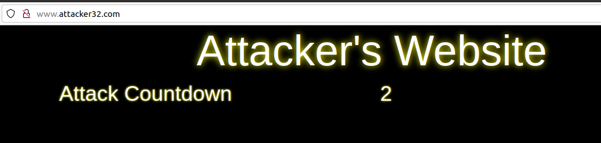
  <figcaption style="text-align: center;">Figure 4. Accessing www.attacker32.com</figcaption>
</figure>

## Task 1. Understanding the Same-Origin Policy Protection

To do this task we need to access the following three websites:

```bash
URL 1: http://www.seedIoT32.com
URL 2: http://www.seedIoT32.com/change
URL 3: http://www.attacker32.com/change
```

Each page is represented in the picture below.

<figure align="center">
  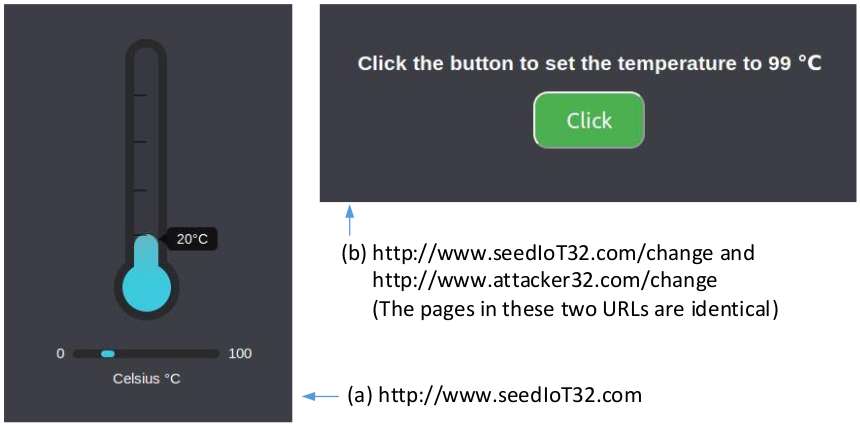
  <figcaption style="text-align: center;">Figure 5. URLs web pages</figcaption>
</figure>

The first page lets us see the current temperature setting of the thermostat. The second and third pages are identical, except that one comes from the IoT server, and the other comes from the attacker's server. When we click the button on both pages, a request will be sent out to the IoT server to set its temperature up to 99º Celsius.

Only the page that comes from the IoT server can successfully raise the temperature of the thermostat. To find out the issue, we opened the web console on the browser. There we found 
an error: 

```
Cross-Origin Request Blocked: The Same Origin Policy disallows reading the remote resource at http://www.seediot32.com/password. 
(Reason: CORS header ‘Access-Control-Allow-Origin’ missing). Status code: 200.
```

<figure align="center">
  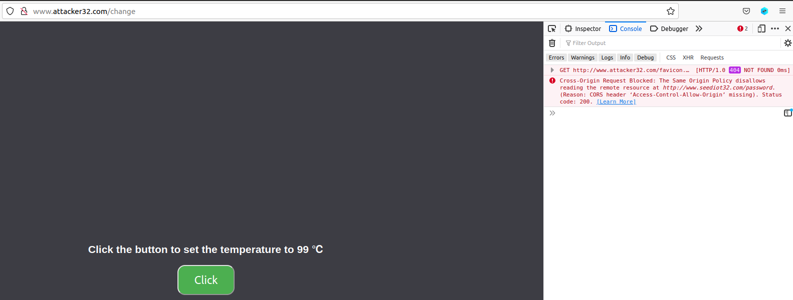
  <figcaption style="text-align: center;">Figure 6. SOP error when fetching another domain</figcaption>
</figure>

This means that the reading of the password resource (`http://www.seediot32.com/password`) is being blocked by the browser's **same-origin policy** since the requested domain is different from the `www.attacker32.com` domain. This mechanism is commonly used to stop a malicious site from reading another site's data.

## Task 2. Defeat the Same-Origin Policy Protection

The goal of this task is to defeat such protection, so we can set the temperature from the attacker's page. 

The main idea for defeating the same-origin protection comes from the fact that the policy enforcement is based on the hostname, not on the IP address, so as long as we use `www.attacker32.com` in the URL, we are complying with the SOP policy. Before the user's browser sends out requests to `www.attacker32.com`, it first needs to know the IP address of `www.attacker32.com`. A DNS request will be sent out from the User's machine. If the IP address is not cached at the local DNS server, a DNS request will eventually be sent to `attacker32.com`'s name server, which is controlled by the attacker. Therefore, the attacker can decide what to put in the response.

### Step 1: Modifying the JavaScript code

The first step is to change the JavaScript code running inside the `www.attacker32.com/change` page, which is located in the attacker's web server container. Since this page comes from the `www.attacker32.com` server, according to the same-origin policy, it can only interact with the same server. Therefore, we need to change the *url_prefix* variable that is being used to make the request, so that the origin is the same server. 

```js
let url_prefix = 'http://www.attacker32.com'// previously http://www.seediot32.com

function updateTemperature() {
  $.get(url_prefix + '/password', function(data) {
  $.post(url_prefix + '/temperature?value=99'  
               + '&password='+ data.password, 
               function(data) {
                  console.debug('Got a response from the server!');
               });
  });
}
```

After making this change we need to restart the attacker's web server container by doing:

```
$ docker container restart attacker-ns-10.9.0.153
```

Then, if we click the button on the attacker's page again, we don't get the same error anymore since the origin is now the same. However, we get a new error: *METHOD NOT ALLOWED*. This is expected since the requests are being sent back to the attacker's web server which does not support these methods.

<figure align="center">
  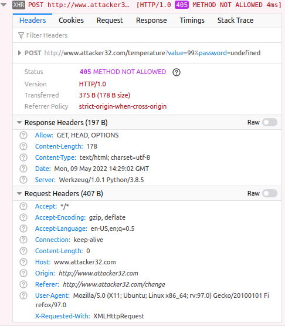
  <figcaption style="text-align: center;">Figure 7. Method Not Allowed error</figcaption>
</figure>

### Step 2: Conduct the DNS rebinding

Instead of the requests being sent to the attacker's web server, we want them to go to the IoT server. This can be achieved using the **DNS rebinding** technique. To do this, we want to map `www.attacker32.com` to the IP address of the attacker’s web server, so the user can get the actual page from http://www.attacker32.com/change. However, before we click on the button on the page, we remap the `www.attacker32.com` hostname to the IP address of the IoT server, so the request triggered by the button will go to the IoT server. 

To change the DNS mapping, we modified the zone file inside the attacker's name server container (`etc/bind/zone_attacker32.com`). 

```bash
# cat etc/bind/zone_attacker32.com
$TTL 2
@       IN      SOA   ns.attacker32.com. admin.attacker32.com. (
                2008111001
                8H
                2H
                4W
                1D)

@       IN      NS    ns.attacker32.com.

@       IN      A     10.9.0.180
;www     IN      A     10.9.0.180
www     IN      A     192.168.60.80
ns      IN      A     10.9.0.153
*       IN      A     10.9.0.100

```

The first entry is the default Time-To-Live (TTL) value (seconds) for the response, specifying how long the response can stay in the DNS cache. We changed this value to 2 seconds. Then, we commented on the `www     IN      A     10.9.0.180` line and added the `www     IN      A     192.168.60.80` line. This way we are mapping the `www.attacker32.com` hostname to the IP address of the IoT server (`192.168.60.80`).

After making the changes to the zone file, we asked the name server to reload the revised zone data using the following command:

```
# rndc reload attacker32.com
```

We also had to clean out the cached old DNS mapping for the `www.attacker32.com` so we didn't have to wait 1000 seconds for it to expire, as it was previously set in the zone file. We did this with the following command on the local DNS container:

```
# rndc flush
```

After this, without reloading the browser's page that was pointing to `www.attacker32.com/change` we clicked the button again and this time we were able to change the thermostat's temperature successfully to 99º degrees. 

<figure align="center">
  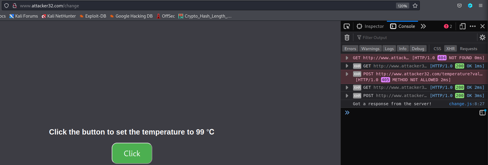
  <figcaption style="text-align: center;">Figure 8. Changing thermostat's temperature without reloading the page</figcaption>
</figure>

<figure align="center">
  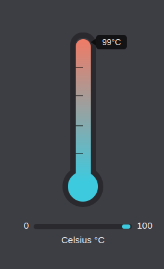
  <figcaption style="text-align: center;">Figure 9. New thermostat's temperature</figcaption>
</figure>

The result can be seen in the above images.

## Task 3. Launch the Attack

In the previous task, the user has to click the button to set the temperature to a dangerously high value. Obviously, it is unlikely that users will do that. So, in this task, we need to do that automatically. 

There is already a web page for that purpose. It can be accessed using the following URL: `http://www.attacker32.com`. It has a timer, which goes down from 10 to 0. Once it reaches 0, the JavaScript code on this page will send the set-temperature request to `http://www.attacker32.com`, and then reset the timer value to 10. This task's objective was to use the DNS rebinding technique, so once the timer reaches 0, the thermostat's temperature is set to 88º Celsius.

Since we mapped the `www.attacker32.com` hostname to the IP address of the IoT server, whenever we try to access the attacker's page, we end up on the IoT page. To fix this, we need to edit the zone file inside the attacker's name server container again. We need to uncomment the line that we commented on before and comment on the new line we added. This way we are remapping the hostname to the IP address of the attacker's web server (like it was before we made any changes).

```bash
...
www     IN      A     10.9.0.180
;www      IN      A     192.168.60.80
...
```

We also, need to ask the name server to reload the revised zone data again since we change the zone file.

```
# rndc reload attacker32.com
```

Then we are able to access the attacker's web page.

<figure align="center">
  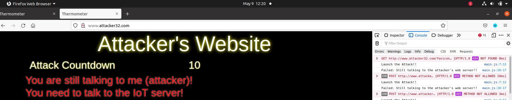
  <figcaption style="text-align: center;">Figure 10. Visiting www.attacker32.com</figcaption>
</figure>

As seen in the picture, we are failing to send the request to the IoT server. The reason for this is that the zone file was changed back to remap the hostname to the attacker's page. To fix this, we just need to change it again to the previous mappings and reload the revised zone data.

```bash
...
;www     IN      A     10.9.0.180
www     IN      A     192.168.60.80
...
```

This way, upon sending the request to `www.attacker32.com`, we will actually send the request to the IoT server instead of the attacker's web server.

```
# rndc reload attacker32.com
```

By doing this, we successfully launched the attack. When the timer reaches 0, a message appears indicating that we are talking to the IoT server. The error messages on the web console stop appearing and the thermostat's temperature is set to 88 degrees every time the timer reaches 0.

<figure align="center">
  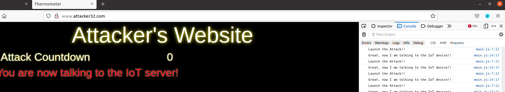
  <figcaption style="text-align: center;">Figure 11. DNS Rebinding attack success</figcaption>
</figure>

<figure align="center">
  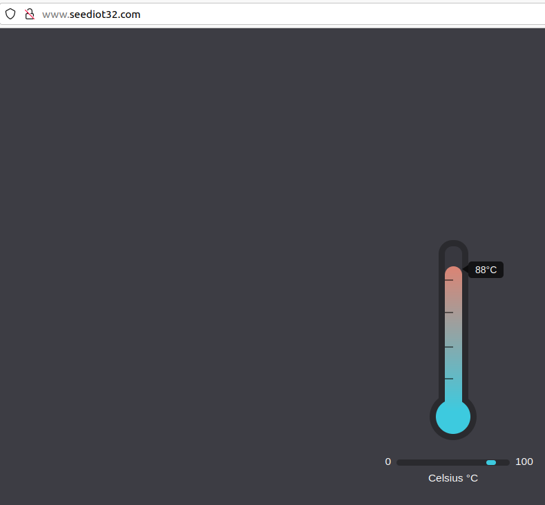
  <figcaption style="text-align: center;">Figure 12. DNS Rebinding attack effect</figcaption>
</figure>

## Defending Against DNS Rebinding Attacks

As seen throughout this lab, the DNS Rebinding attack exposes internal services to outside attackers, even using the browser's sandbox mechanism. The problem is that SOP uses hostnames to enforce this policy, but this security measure can be bypassed if attackers can control what IP address the domain name maps to. Several solutions have been proposed to solve this problem. For example, one solution is to require browsers to pin the IP address, so rebinding becomes hard. Another solution is to harden the DNS resolvers to prevent external names from resolving to internal addresses.