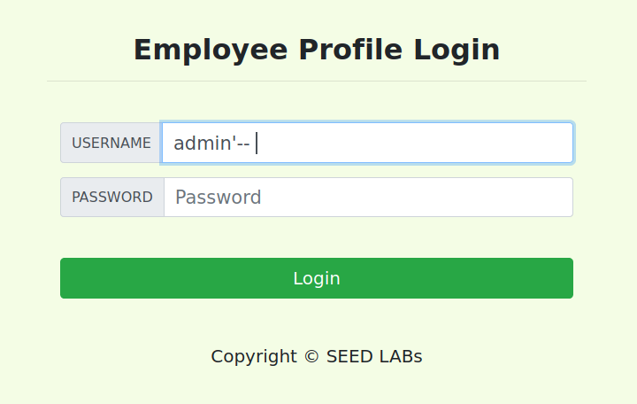
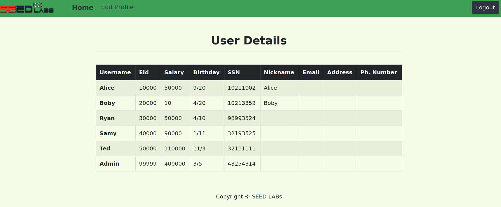
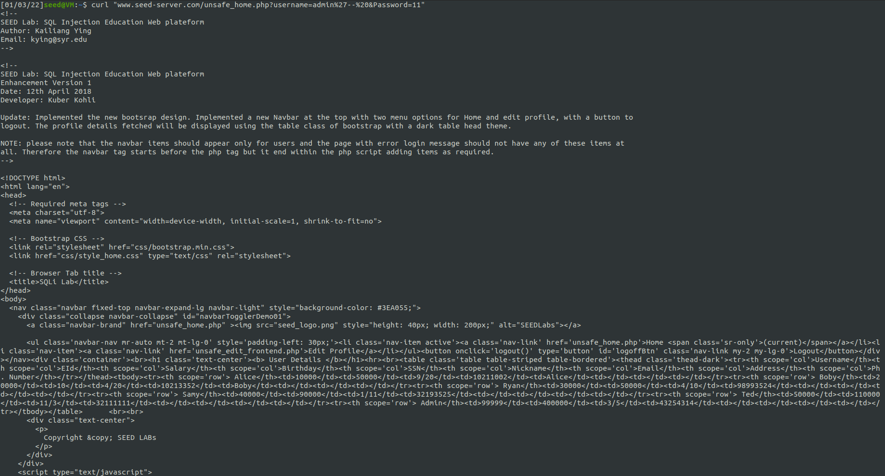
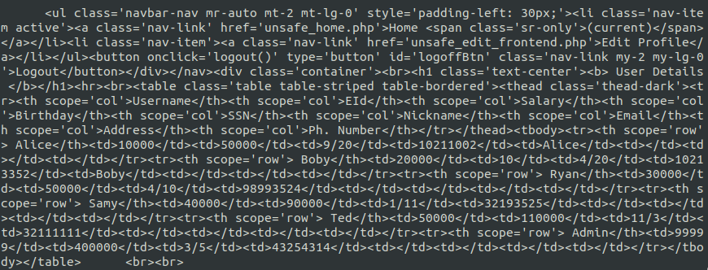
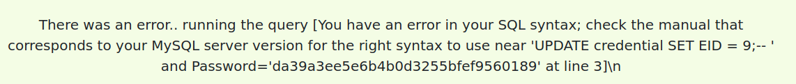
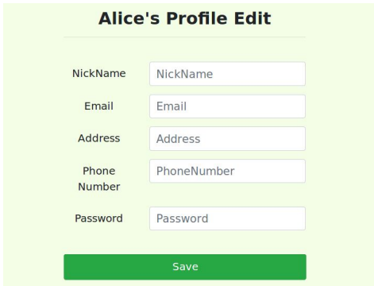
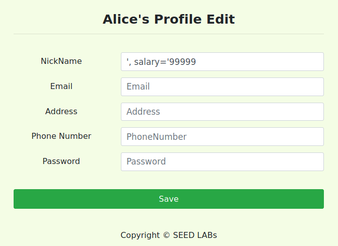
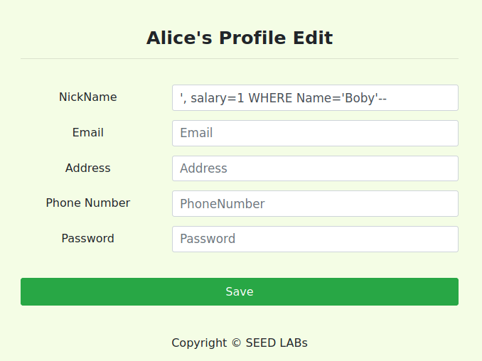
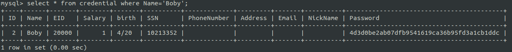

# SQL Injection Attack Lab

This week's suggested lab was SQL Injection Attack Lab, from SEED labs, to find ways to exploit SQL injection vulnerabilities, demonstrate the damage that can be achieved by the attack, and master the techniques that can help defend against such types of attacks.

## Task 1

After running the given containers and getting a shell on the MySQL container, we followed the given steps to use the `mysql` client program to run different database commands. 

Using the `use` command, we logged in and loaded the existing `sqllab_users` database. After printing the names of all the tables using the `show tables;` command, we are tasked to print all the employee profile information "Alice".

As we want to query the database, in this case regarding the `credential` table, we needed to use a `SELECT` SQL statement. This can be done with the `select` command in the `mysql` client. As we have the information about the names of the different columns, we can build the query as follows:

`SELECT * FROM credential WHERE Name='Alice'`

<figure align="center">
  
  <figcaption>Figure 1. Query results.</figcaption>
</figure>

This output gives us all the information on the different columns regarding the employee named "Alice".


## Task 2

### Task 2.1

In this task, we must log in to the web application as the administrator, knowing the user's name is `admin`.

By looking at the login page and its server code, we can see that we can use a SQL Injection attack to manipulate the query used in the login process, therefore managing to log in as `admin` without any knowledge of the correct password.

```php
$sql = "SELECT id, name, eid, salary, birth, ssn, address, email,
        nickname, Password
        FROM credential
        WHERE name= '$input_uname' and Password='$hashed_pwd'";
```

```php
if(id != NULL) {
    if(name==’admin’) {
        return All employees information;
    } else if (name !=NULL){
        return employee information;
    }
} else {
    Authentication Fails;
}
```

The login page form has two fields for input: `Username` and `Password`, which in the code are represented by `$input_name` and `$input_pwd`, respectively, and these values are used in a SQL query to get the corresponding user by matching both the `Username` and hashed password. If the query result is not empty, the authentication succeeded. 

To manipulate this query into returning the information of the `admin` user, we can use the 'Username' field and use a SQL Injection attack and comment out the part of the query that checks the password. This can be done by inserting the name' admin' into the 'Username' field and injecting an SQL comment, so the rest of the query is not executed.

So the resulting input should be as the following:

<figure align="center">
  
  <figcaption>Figure 2. Web application input.</figcaption>
</figure>

> **Note**: From the documentation:
> ```
> From a -- sequence to the end of the line. 
> In MySQL, the -- (double-dash) comment style requires the second dash to be followed by at least one whitespace or control character (such as a space, tab, newline, and so on). 
> This syntax differs slightly from standard SQL comment syntax, as discussed in Section 1.8.2.4, “'--' as the Start of a Comment”.
> ```
> So it is important that an empty space character is always added after the second dash.

The following information is given by pressing "Login", representing all the users' information, indicating that the `admin` authentication was successful.

<figure align="center">
  
  <figcaption>Figure 3. Web application result.</figcaption>
</figure>


### Task 2.2

The objective of this task is to get the same result as the last task but without using the web application page but by sending HTTP requests. We will be using the `curl` tool in the command line.

To do the login process, we want to send an HTTP GET request to the `unsafe_home.php` page, sending the `username` and `Password` as parameters.

To correctly do this, special characters must be encoded. In this case, as we use the single quote `'` and space ` ` characters in the `username` field, we must use the encoded versions: %27 and %20, respectively.

`curl "www.seed-server.com/unsafe_home.php?username=admin%27--%20&Password=11"`

<figure align="center">
  
  <figcaption>Figure 4. Curl request.</figcaption>
</figure>

<figure align="center">
  
  <figcaption>Figure 5. Curl response table.</figcaption>
</figure>

As we can see, the HTML table containing the information on all the users is included in the request's response, telling us that the authentication worked.

### Task 2.3
In this task, we faced a countermeasure that prevented us from executing two SQL statements in the attack. If we tried inserting in the 'Username' form field the following:

`admin';UPDATE credential SET EID = 9;-- `

If we could execute more than one command, we would log in as `admin`, and all the users in the `credential` table would have an`EID` of 9. Instead, we get a backend error, as shown in the following picture.

<figure align="center">
  
  <figcaption>Figure 6. Error when executing two SQL statements.</figcaption>
</figure>

The mentioned countermeasure has to the with the method used when building queries, the `query($sql)` method, which does not allow the execution of more than one SQL statement, as shown here:

```php
$result = $conn->query("SELECT id, name, eid, salary, ssn
                        FROM credential
                        WHERE name= '$input_uname' and Password= '$hashed_pwd'");
```

The `query($sql)` method works like that because executing multiple queries simultaneously with this method can be potentially dangerous and should be avoided when possible, especially when handling user inputs. There is better control of the execution flow if one query at a time is executed and its result is checked, rather than grouping all of them in a single call. The same does not happen with the `multi_query($sql)` method, which allows the execution of multiple SQL statements, and, in case this was the method being used, our query would have run just fine.

## Task 3

This task is about the SQL injection on the `UPDATE` Statement. This kind of injection is even more dangerous than the previous ones, as it gives the attacker the possibility to modify the database.

### Task 3.1

The first goal is to take advantage of the SQL injection vulnerability to modify our salary. As we can see on the following page, regular users can edit their nicknames, emails, addresses, phone numbers, and passwords. However, they are not authorized to modify their salary.

<figure align="center">
  
  <figcaption>Figure 7. Edit Profile Page.</figcaption>
</figure>

Additionally, we have access to the source code of the PHP code that calls the SQL`UPDATE` statement:

```php
$hashed_pwd = sha1($input_pwd);
    $sql = "UPDATE credential SET
    nickname=’$input_nickname’,
    email=’$input_email’,
    address=’$input_address’,
    Password=’$hashed_pwd’,
    PhoneNumber=’$input_phonenumber’
    WHERE ID=$id;";
$conn->query($sql);
```

As happens in the previous cases, the user inputs are not being properly sanitized, which gives us the ability to insert an additional SQL statement in one of the inputs. Assuming that salaries are stored in a column called `salary`, we can achieve our goal by specifying the desired salary:

<figure align="center">
  
  <figcaption>Figure 8. UPDATE Statement SQL injection</figcaption>
</figure>

With the above command, we keep Alice's nickname Alice and set her salary to 99999!

### Task 3.2

The objective for this task is to change Boby's salary using the Profile Edit page as Alice. To do this, we provide a similar input as the previous task, but the `WHERE` clause must be changed to match the user we want. In this case, we can use `WHERE Name='Boby'` and then insert a SQL comment.

So the resulting input should be `',salary=1 WHERE name='Boby'-- `

<figure align="center">
  
  <figcaption>Figure 9. Change others' salary input.</figcaption>
</figure>

<figure align="center">
  
  <figcaption>Figure 10. Boby information in database.</figcaption>
</figure>